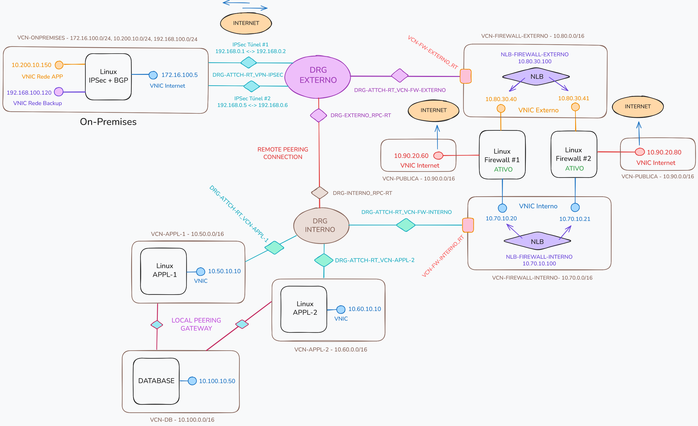

# OCI Network Routing

Hands-on labs e estudos avançados sobre roteamento de rede no Oracle Cloud Infrastructure (OCI), cobrindo VCNs, DRGs, Remote Peering, BGP, IPSec, e inspeção de tráfego com Linux Firewall. Todo o provisionamento do ambiente é realizado via Terraform a partir do diretório ```terraform/```.



## Documentação

1. [Descrição dos componentes de Rede](./docs/descricao-componentes-rede.md)

## Terraform Quick Setup

### 1. Pré-requisitos

Antes de começar, você precisa:

1. Conta ativa no OCI com as devidas permissões
2. OCI CLI configurado ou credenciais de API
3. Git
4. Terraform

### 2. Clonar o repositório

```
$ git clone git@github.com:daniel-armbrust/oci-network-basics.git
$ cd oci-network-basics
```

### 3. Baixar e instalar o Terraform

```
$ wget https://releases.hashicorp.com/terraform/1.14.4/terraform_1.14.4_linux_amd64.zip
$ unzip terraform_1.14.4_linux_amd64.zip
$ sudo mv terraform /usr/local/bin/
```

```
$ ./terraform -version
Terraform v1.14.4
on linux_amd64
```

- Para maiores informações, consulte: <a href="https://developer.hashicorp.com/terraform/install" target="_blank" rel="noopener noreferrer">Hashicorp - Install Terraform</a>

### 4. Entrar no diretório terraform

```
$ terraform/
```

### 5. Criar o arquivo terraform.tfvars

```
$ cp terraform.tfvars-example terraform.tfvars
```

### 6. Preencher as variáveis do OCI

```
$ vi terraform.tfvars
```

```
api_private_key_path  = ""
api_fingerprint       = ""
tenancy_id            = ""
user_id               = ""
root_compartment      = ""
```

#### `api_private_key_path`

Caminho completo para o arquivo da chave privada associada ao usuário OCI.  
Essa chave é utilizada para assinar as requisições feitas à API.

#### `api_private_key_path`

Fingerprint da chave pública registrada no usuário OCI.
É gerado automaticamente quando a chave é cadastrada no OCI Console.

#### `tenancy_id`

OCID da tenancy OCI onde os recursos serão criados.
Identifica unicamente sua conta Oracle Cloud.

#### `user_id`

OCID do usuário OCI que executará as chamadas via Terraform.
Esse usuário precisa ter permissões suficientes para criar e gerenciar recursos.

#### `root_compartment`

OCID do compartimento raiz onde os recursos serão provisionados.

- Para maiores informações, consulte: <a href="https://docs.oracle.com/en-us/iaas/Content/API/Concepts/devguidesetupprereq.htm" target="_blank" rel="noopener noreferrer">OCI - Setup and Prerequisites</a>

### 7. Inicializar o Terraform

```
$ terraform init
```

### 8. Revisar o plano e criar a infraestrutura

```
$ terraform plan
```

```
$ terraform apply
```

### 9. Remover os recursos criados

```
$ terraform destroy
```

### 10. Erros Conhecidos

- Erro relacionado ao tempo de criação do Remote Peering, que não se fica disponível dentro do tempo esperado. Para resolver, basta executar novamente o comando ```terraform apply```.

```
Error: Invalid index
│
│   on main.tf line 25, in module "vcn-appl-1":
│   25:     drg-interno_rpc_id = "${data.oci_core_drg_attachments.drg-interno_rpc-attch.drg_attachments[0].id}"
│     ├────────────────
│     │ data.oci_core_drg_attachments.drg-interno_rpc-attch.drg_attachments is empty list of object
│
│ The given key does not identify an element in this collection value: the collection has no elements.
```
