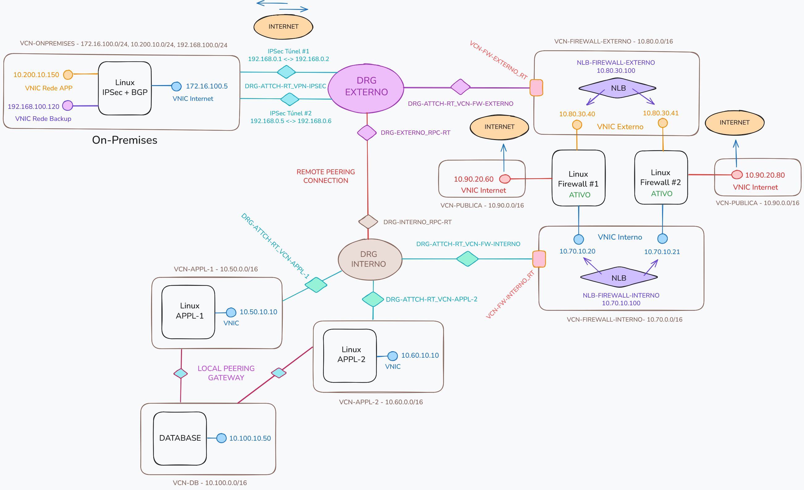

# OCI Network Basics

Guia básico sobre o funcionamento da rede no **Oracle Cloud Infrastructure (OCI)**, abordando conceitos como VCNs, DRGs, Remote Peering, BGP, IPSec e inspeção de tráfego com firewall Linux.

**DISCLAIMER**: _Este é um guia de estudos NÃO OFICIAL que reflete o entendimento do autor sobre os diversos componentes e serviços de redes oferecidos pelo OCI. O conteúdo deste repositório NÃO SUBSTITUI a documentação oficial e NÃO OFERECE GARANTIAS. O OCI é uma plataforma de nuvem na qual novos serviços e melhorias são introduzidos continuamente. É recomendado sempre consultar a [documentação oficial](https://docs.oracle.com/en-us/iaas/Content/GSG/Concepts/baremetalintro.htm) pois o conteúdo aqui, pode cair em desuso ou sofrer atualizações._

## Topologia de Rede Utilizada

O objetivo deste repositório é fornecer um entendimento geral sobre o funcionamento dos componentes de rede, usando como exemplo a topologia a seguir:



## Documentação

1. [Visão Geral dos Componentes de Rede do OCI](./docs/visao-geral-componentes-de-rede-do-oci.md)
2. [Componentes de Rede da Topologia de Referência](./docs/componentes-de-rede-da-topologia-de-referencia.md)
3. [VCN e Roteamento de Sub-rede](./docs/vcn-e-roteamento-de-subrede.md)
4. [Nota sobre VNICs](./docs/nota-sobre-vnics.md) 
5. [Firewall e Conntrack Table](./docs/firewall-e-conntrack-table.md)
6. [Funcionamento do Roteamento no DRG](./docs/funcionamento-do-roteamento-no-drg.md)
7. [Roteamento via Firewall Central (hub & spoke)](./docs/roteamento-via-firewall-central.md)
8. [Network Visualizer](./docs/network-visualizer.md)
9. [Nota sobre Rotas Dinâmicas](./docs/nota-sobre-rotas-dinamicas.md)
9. [Linux Policy Routing](./docs/linux-policy-routing.md)
10. [DNS](./docs/dns.md)
11. [Monitoração e Throubleshoot](./docs/monitoracao-e-throubleshoot.md)

## Terraform Quick Setup

A seguir, o passo a passo para criar, no OCI via [Terraform](https://developer.hashicorp.com/terraform), os componentes de rede usados na topologia de estudo:

### 1. Pré-requisitos

Antes de começar, você precisa:

1. Conta ativa no OCI com as devidas permissões
2. OCI CLI configurado ou credenciais de API
3. Git
4. Terraform

### 2. Clonar o repositório

```bash
$ git clone git@github.com:daniel-armbrust/oci-network-basics.git
$ cd oci-network-basics
```

### 3. Baixar e instalar o Terraform

```bash
$ wget https://releases.hashicorp.com/terraform/1.14.4/terraform_1.14.4_linux_amd64.zip
$ unzip terraform_1.14.4_linux_amd64.zip
$ sudo mv terraform /usr/local/bin/
```

```bash
$ ./terraform -version
Terraform v1.14.4
on linux_amd64
```

- Para maiores informações, consulte: <a href="https://developer.hashicorp.com/terraform/install" target="_blank" rel="noopener noreferrer">Hashicorp - Install Terraform</a>

### 4. Entrar no diretório terraform

```bash
$ terraform/
```

### 5. Criar o arquivo terraform.tfvars

```bash
$ cp terraform.tfvars-example terraform.tfvars
```

### 6. Preencher as variáveis do OCI

```bash
$ vi terraform.tfvars
```

```bash
api_private_key_path  = ""
api_fingerprint       = ""
tenancy_id            = ""
user_id               = ""
root_compartment      = ""
```

#### `api_private_key_path`

Caminho completo para o arquivo da chave privada associada ao usuário OCI.  
Essa chave é utilizada para assinar as requisições feitas à API.

#### `api_private_key_path`

Fingerprint da chave pública registrada no usuário OCI.
É gerado automaticamente quando a chave é cadastrada no OCI Console.

#### `tenancy_id`

OCID da tenancy OCI onde os recursos serão criados.
Identifica unicamente sua conta Oracle Cloud.

#### `user_id`

OCID do usuário OCI que executará as chamadas via Terraform.
Esse usuário precisa ter permissões suficientes para criar e gerenciar recursos.

#### `root_compartment`

OCID do compartimento raiz onde os recursos serão provisionados.

- Para maiores informações, consulte: <a href="https://docs.oracle.com/en-us/iaas/Content/API/Concepts/devguidesetupprereq.htm" target="_blank" rel="noopener noreferrer">OCI - Setup and Prerequisites</a>

### 7. Inicializar o Terraform

```bash
$ terraform init
```

### 8. Revisar o plano e criar a infraestrutura

```bash
$ terraform plan
```

```bash
$ terraform apply
```

### 9. Remover os recursos criados

```bash
$ terraform destroy
```