# DNS

## DNS Privado e Híbrido

Podemos dizer de forma bem resumida que o DNS ou Sistema de Nomes de Domínio, é um tipo de banco de dados distribuído e especializado em resolver nomes de domínios em endereços IP numéricos e vice-versa.

Aqui quero apresentar alguns detalhes do serviço DNS Privado no qual é parte integrante de toda rede criada no OCI. Além disso, como você verá, o DNS Privado é um serviço fundamental em cenários de Nuvem Híbrida (mix de on-premises e cloud).

## VCN e DNS

A maioria dos recursos que são criados dentro de uma VCN necessitam de um serviço de DNS previamente configurado e funcional. Um bom exemplo é o próprio Serviço Database, que quando instruído para criar um novo banco de dados (DBCS), irá usar um serviço de DNS disponível para registrar o seu SCAN (Single Client Access Names):

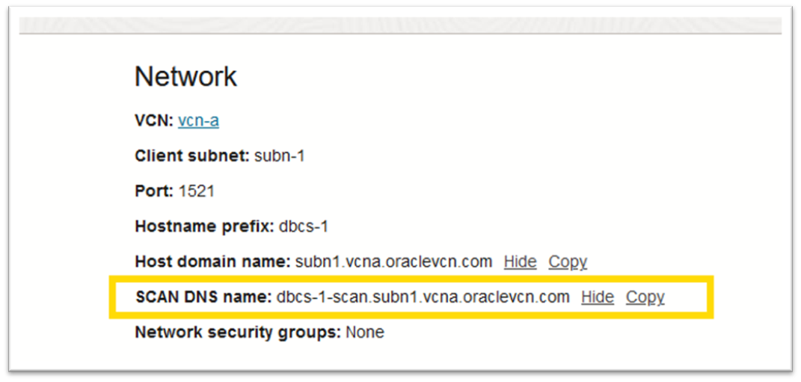

Sem um DNS disponível, o banco de dados não consegue registrar o "SCAN DNS name":

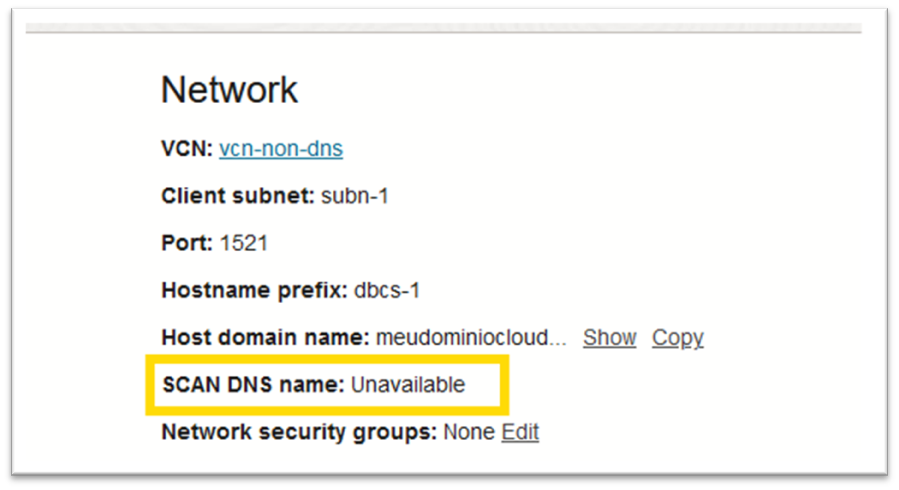

Esse relacionamento entre VCN e DNS é muito importante e garante o correto provisionamento dos recursos aqui no OCI. Para entender melhor, irei voltar um pouco atrás e mostrar alguns detalhes referente a criação de uma Virtual Cloud Network ou VCN.

Sempre que criamos uma nova VCN, há a possibilidade de habilitar durante a sua criação o que chamamos de Resolução DNS (DNS Resolution):

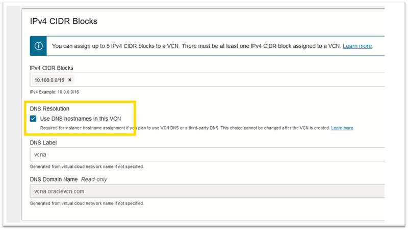

Esta opção `Use DNS hostnames in this VCN` quando habilitada, possibilita o registro e a resolução de nomes DNS (hostnames) dos recursos que forem criados nesta VCN. Ou seja, um recurso quando criado, poderá ser “encontrado” (endereçado) pelo seu nome (hostname), além do seu endereço IP.

Perceba que existe também a possibilidade de se especificar um DNS Label:

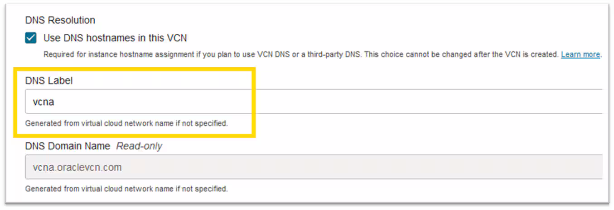

Além da VCN, existe a mesma opção de `DNS Resolution` disponível ao criar uma sub-rede:

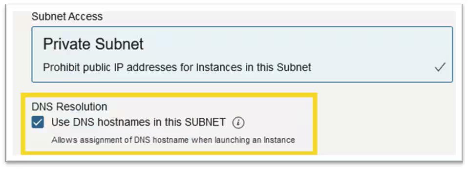

Igual às configurações da VCN, é possível especificar um `DNS Label` também para a sub-rede. A união desses dois DNS Labels (VCN e sub-rede), junto com o nome de domínio `oraclevcn.com`, formam então um nome de domínio único (DNS Domain Name) que será usado para os recursos aqui criados:

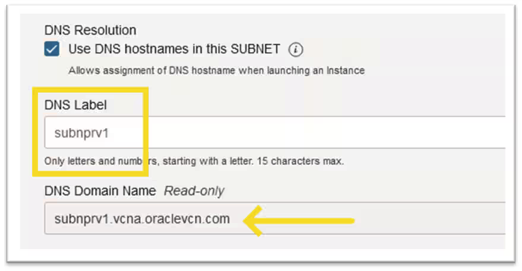

Não é obrigatório, porém é uma boa prática, que os DNS Labels sejam únicos entre as VCNs que você criar. Dentro de uma mesma VCN, o DNS Label das sub-redes devem ser únicos.

Habilitando o DNS dessa forma, nos permite especificar um Hostname para uma instância computacional quando esta for criada. Como resultado, temos o que chamamos de **nome de domínio completamente qualificado (FQDN – Fully Qualified Domain Name)**:

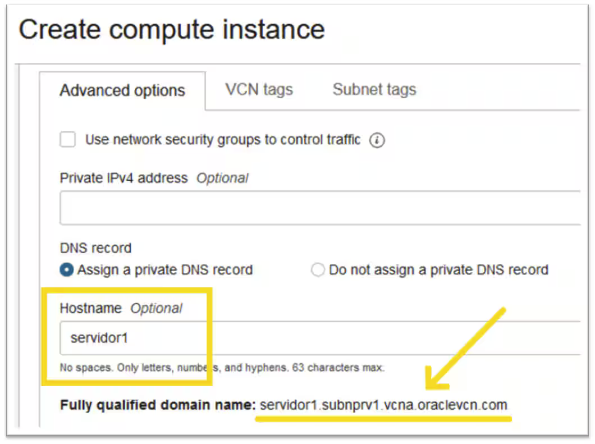

É uma boa prática sempre utilizar o FQDN da instância quando se deseja enviar mensagens para um host. Sempre utilize nome ao invés do endereço IP.

Em conjunto com todo esse processo, que possibilita o registro e a resolução de nomes pela VCN e sub-rede, o OCI criou e configurou o DNS Privado. Vamos entender mais como ele funciona.

## DNS Privado

[DNS Privado](https://blogs.oracle.com/lad-cloud-experts-pt/dns-privado-e-hibrido) é o serviço de DNS do OCI usado exclusivamente para registro e “resolução de nomes internos”. Quando dizemos “nomes internos”, estamos nos referindo a todos os nomes de hosts (hostnames) que não estão diretamente expostos na Internet (rede pública).

Quando a VCN foi criada, com a opção `Use DNS hostnames in this VCN` habilitada, também foram criados os seguintes recursos que fazem parte do DNS Privado:

- **Zona DNS**
    - Uma Zona DNS é o local onde são armazenados os _[Registros de Recursos](https://docs.oracle.com/pt-br/iaas/Content/DNS/Tasks/privatedns.htm#privatedns_topic_supported_resource_records)_.

- **View**
    - Usado para agrupar diferentes Zonas. Ou seja, dentro de uma View podem existir diferentes Zonas de diferentes nomes (os nomes devem ser exclusivos). Porém, uma Zona pode estar associada a diferentes Views.

- **DNS Resolver**
    - É um endereço IP (endpoint) que possui a função exclusiva de responder às consultas DNS que são feitas. Por padrão, o resolvedor utiliza o endereço IP `169.254.169.254` que só pode ser acessado pelos recursos de uma sub-rede.

Vamos entender a relação dos recursos que foram citados para assim, entender melhor o serviço.

### Zona DNS

Uma das características do _[DNS](https://docs.oracle.com/pt-br/iaas/Content/DNS/Tasks/privatedns.htm)_ é ser um banco de dados de uso mais específico. Quando eu digo "mais específico", quero dizer basicamente que o serviço só é capaz de manipular as informações referente ao nome dos hosts e endereços IPs. Além de que, no DNS, NÃO organizamos os dados em Tabelas como é feito em um banco de dados tradicional. No DNS, os dados são criados e organizados dentro do que chamamos de Zona DNS.

No OCI, uma Zona DNS pode ser _Pública_ ou _Privada_:

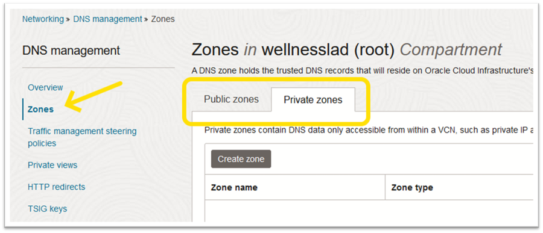

Uma _Zona DNS Pública_, tem o propósito de armazenar os registros que serão expostos publicamente na Internet. Já a _Zona Privada_, só fornece respostas para os clientes que podem acessá-la por meio de uma VCN (visualização interna).

Para o exemplo que foi apresentado, sobre a criação de uma VCN e sub-rede, o OCI criou automaticamente duas _Zonas Privadas_:

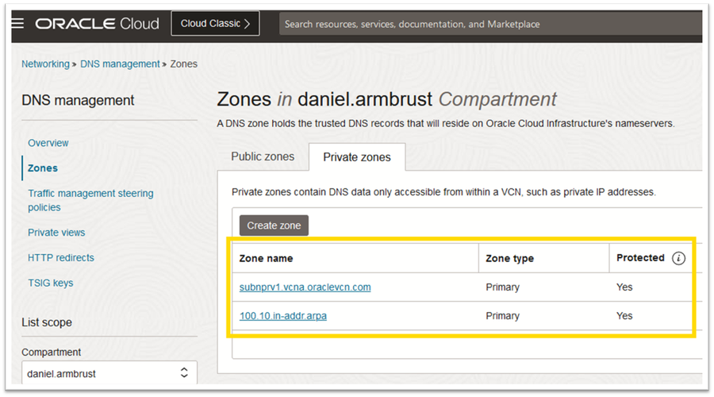

A zona de nome `subnprv1.vcna.oraclevcn.com` foi formada pela junção dos `DNS Labels` especificados junto com o domínio `oraclevcn.com`. Essa zona irá armazenar os registros dos recursos que são criados nesta sub-rede. Veja abaixo o exemplo de uma instância criada de nome `srv1` e seu endereço IP correspondente:

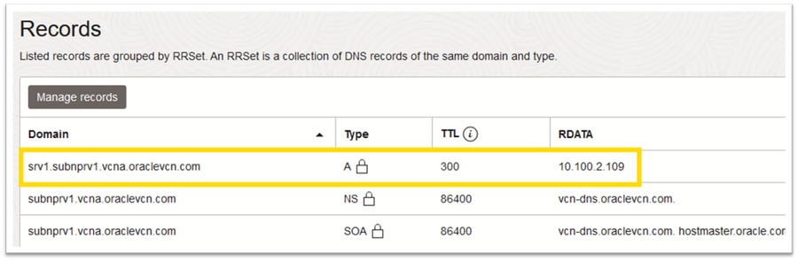

Já a outra zona de nome `100.10.in-addr.arpa`, será usada exclusivamente para armazenar os **Registros Reversos (PTR)** dos recursos. Estas servem para resolver o nome de forma inversa, pois resolve um endereço IP de volta para um _nome de domínio totalmente qualificado (FQDN)_:

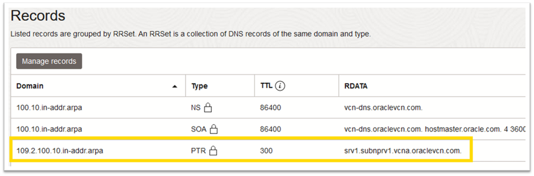

Toda Zona criada e gerenciada pelo OCI, é protegida (protected). Com isso, seus registros podem ser visualizados, porém não é possível adicionar novos ou modificar os existentes.

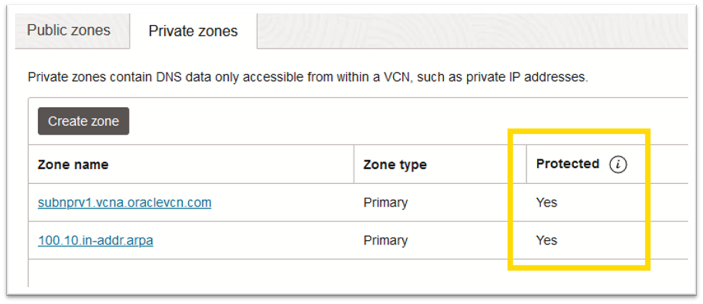

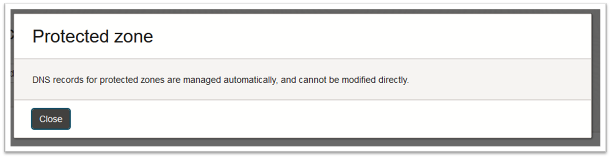

### View

Uma View tem o propósito de agrupar diferentes Zonas. Ao criamos uma Zona Privada, é obrigatório que essa pertença a uma Private View:

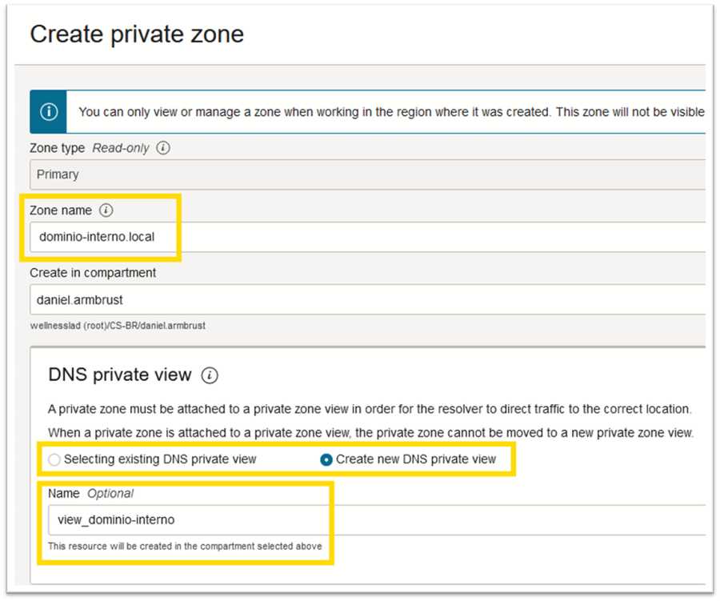

A VCN que foi criada como exemplo, também criou a sua própria Private View, adicionando a ela, as duas Zonas que vimos anteriormente:

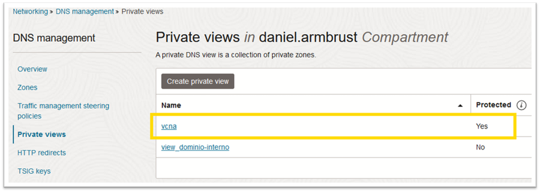

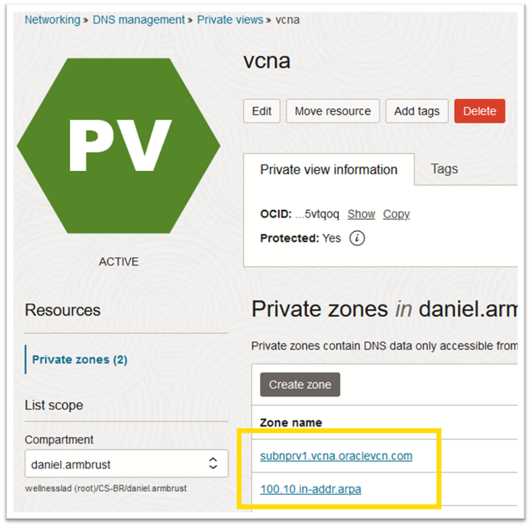

### DNS Resolver

O DNS Resolver é o componente que consegue resolver e responder por uma consulta de DNS que é feita.

Sabemos que os dispositivos em uma rede de computadores usam o endereço IP para se comunicar uns com os outros. O DNS é um serviço que, basicamente, possibilita nomearmos os dispositivos de uma rede (hostname). Ou seja, o nome passa a ser mais uma forma de endereçamento.

Assim, quando usamos um nome para encontrar um recurso, usamos também um DNS Resolver para realizar essa tradução de nome para endereço IP, ou vice-versa.

Para você saber, o OCI utiliza a rede `169.254.0.0/16` para disponibilizar parte de seus serviços. Os endereços dessa rede são acessíveis somente pelos recursos da sub-rede. Alguns desses endereços são usados em _[conexões do tipo iSCSI](https://docs.oracle.com/pt-br/iaas/Content/Block/Tasks/connectingtoavolume.htm#Connecting_to_a_Volume)_ (usado pelo serviço de _[Block Volume](https://docs.oracle.com/pt-br/iaas/Content/Block/Concepts/overview.htm)_), para visualizar os _[metadados de uma instância](https://docs.oracle.com/pt-br/iaas/Content/Compute/Tasks/gettingmetadata.htm)_ e também para o DNS Resolver.

Os endereços que fazem parte da rede `169.254.0.0/16` são acessíveis somente pelos recursos existentes em uma sub-rede. O OCI disponibiliza alguns serviços, de maneira interna à sub-rede, através dos IPs disponíveis nesta rede. Essa rede de endereços possui o nome de _[Link-Local Addresses](https://en.wikipedia.org/wiki/Link-local_address)_.

Por padrão, o DNS Resolver é disponibilizado no endereço IP `169.254.169.254`, e usado pelas instâncias que forem criadas, caso não seja especificado o contrário. Veja abaixo, o conteúdo do arquivo /etc/resolv.conf que faz uso deste resolver em um Oracle Linux:

```shell
[opc@servidor1 ~]$ grep nameserver /etc/resolv.conf
nameserver 169.254.169.254
```

Este DNS Resolver além de ser capaz de resolver qualquer nome na Internet, consegue resolver também os registros da zona que foi criada em conjunto com a sub-rede. Abaixo a resolução de nomes em ação através do IP `169.254.169.254`:

```shell
[opc@servidor1 ~]$ nslookup
> server 169.254.169.254
Default server: 169.254.169.254
Address: 169.254.169.254#53

> registro.br
Server: 169.254.169.254
Address: 169.254.169.254#53
Non-authoritative answer:
Name: registro.br
Address: 200.160.2.3
Name: registro.br
Address: 2001:12ff:0:2::3

> servidor1
Server: 169.254.169.254
Address: 169.254.169.254#53
Non-authoritative answer:
Name: servidor1.subprv1.vcna.oraclevcn.com
Address: 10.0.1.159
```

## Mais sobre o DNS Resolver

O DNS Resolver possui diversas outras configurações que podem ser acessadas por dentro da VCN:

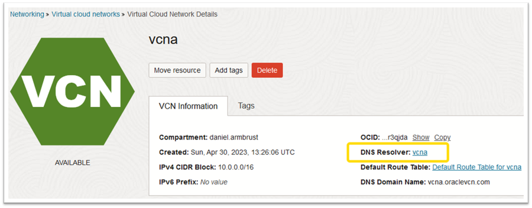

Nas suas configurações, são apresentadas duas informações importantes:

- **Dedicated virtual cloud network**
    - Indica a VCN no qual este DNS Resolver pertence

- **Default Private View**
    - Indica a View privada padrão que foi criada e está associada a este DNS Resolver.

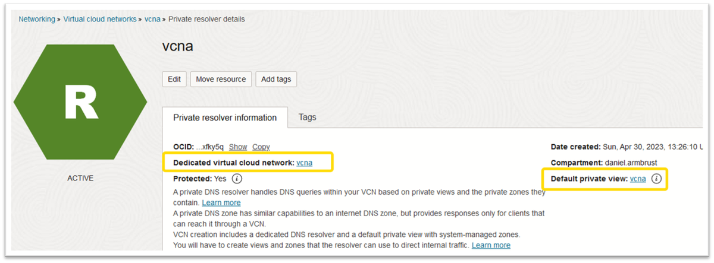

A VCN quando criada com suporte a DNS, também criou e associou em conjunto um DNS Resolver. É obrigatório que um DNS Resolver esteja associado a uma VCN, e também a um Private View. Não se preocupe, todo esse processo é contemplado automaticamente durante a criação da VCN.

De uma forma simples, temos abaixo os componentes do DNS Privado para a VCN que foi criada:

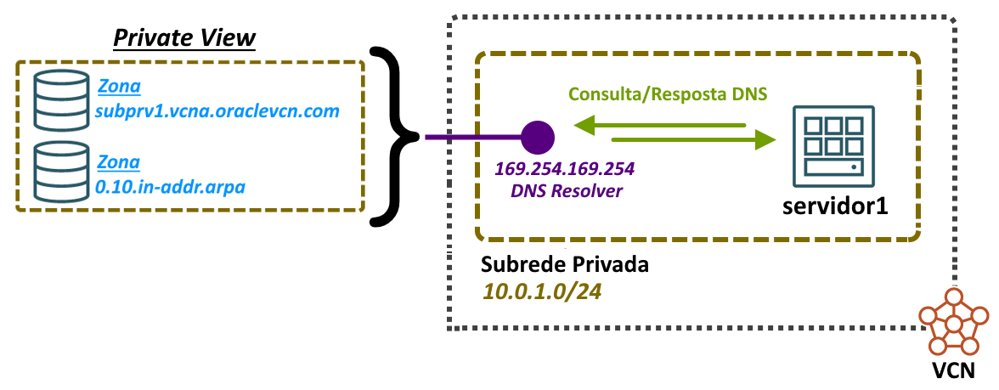

O desenho mostra uma Private View que agrupa duas zonas de nomes `subnprv1.vcna.oraclevcn.com` e `100.10.in-addr.arpa`. Essas são usadas para armazenar os hostnames e demais registros DNS que forem criados nesta sub-rede. Um detalhe importante é que, uma Zona Privada não pode existir sem pertencer a uma Private View. Isto é obrigatório!

Uma ou mais Private Views podem estar associadas a um ou mais DNS Resolvers. Isso irá possibilitar o DNS Resolver em responder ou, resolver os nomes dos registros existentes nas Zonas contidas em suas respectivas Private Views.

Ao criarmos uma outra VCN, por exemplo, uma outra Private View é criada em conjunto. Se a intenção é possibilitar que a VCN-A resolva os nomes da VCN-B, deve-se associar a Private View da VCN-B em VCN-A. Isto pode ser feito dentro das configurações do DNS Resolver da VCN-A, pela associação das Views. Veja:

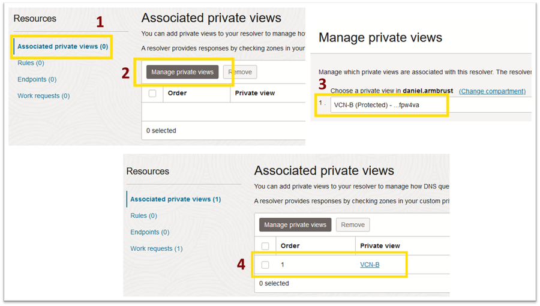

Simples! Agora, o DNS Resolver da VCN-A consegue resolver os nomes contidos nas zonas da VCN-B.

Uma outra opção importante quando configuramos o DNS Privado, diz respeito ao endereço IP do resolvedor. Já sabemos que, por padrão, o DNS Privado utiliza do endereço IP `169.254.169.254` e que este é um IP não roteável. Ou seja, ele só é acessível pelos recursos de dentro da sub-rede.

Uma das ações ao interligarmos cloud e on-premises, é possibilitar a correta resolução de nomes entre esses dois ambientes. Para que o ambiente on-premises consiga resolver os nomes dos recursos existentes na cloud, primeiramente é necessário que ambos os DNS "conversem" via rede. Para isso, o DNS Resolver precisa de um endereço IP roteável que pode ser criado através da opção Endpoints:

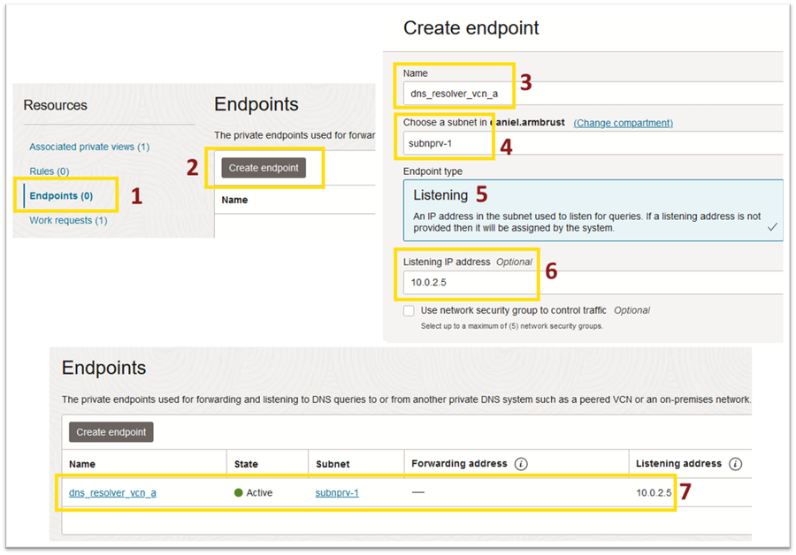

Como é possível verificar, a criação do endpoint exige uma sub-rede. Dessa sub-rede, será usado um endereço IP no qual você pode especificar ou deixar o OCI escolher um que esteja livre para utilização. Também é possível especificar um _Network Security Group (NSG)_ para filtrar o tráfego (firewall), se este for o caso.

Pelo endpoint, que agora pode ser acessado diretamente (`10.0.2.5`), é possível configurar o servidor DNS localizado no on-premises e este passar a resolver também, qualquer nome que termine em `oraclevcn.com`. Essa técnica é chamada de _["conditional forwarding"](https://social.technet.microsoft.com/wiki/contents/articles/2517.dns-conditional-forwarding-ou-encaminhadores-condicionais-pt-br.aspx)_:

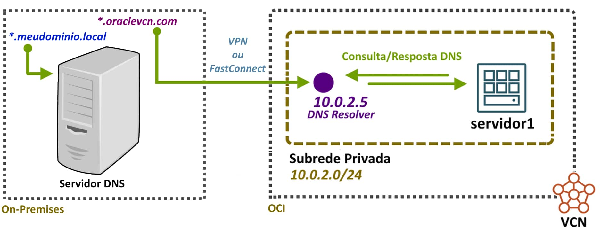

No DNS Resolver, um endpoint pode ser do tipo Listening ou Forwarding. Já vimos que o modo Listening, irá disponibilizar um IP da sub-rede que pode ser usado para responder às consultas DNS externas (Internet) e também das Zonas associadas pelas Private Views.

Já o modo Forwarding permite encaminhar as consultas para um outro servidor DNS externo. Sim, ele também implementa a técnica de _["conditional forwarding"](https://social.technet.microsoft.com/wiki/contents/articles/2517.dns-conditional-forwarding-ou-encaminhadores-condicionais-pt-br.aspx)_ que acabamos de descrever. A criação de um endpoint do tipo Forwarding segue o mesmo padrão:

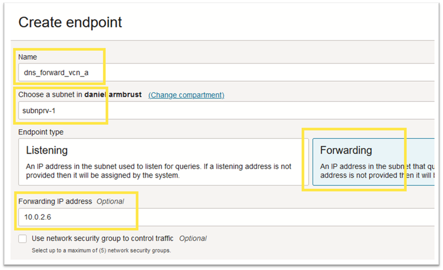

Além da criação do endpoint Forwarding, deve ser criado algumas regras (rules) para que a resolução de nomes seja direcionada para um outro servidor DNS:

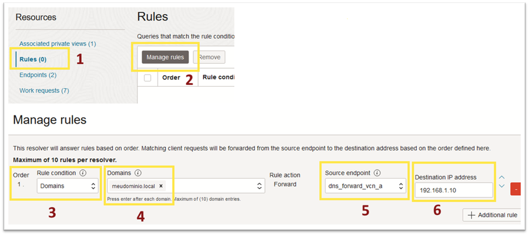

Neste exemplo, quando o DNS Resolver (`10.0.2.5`) receber uma consulta para resolver um nome que faz parte do domínio `meudominio.local`, este pedido será então encaminhado para o servidor DNS `192.168.1.10` realizar a resolução ("conditional forwarding").

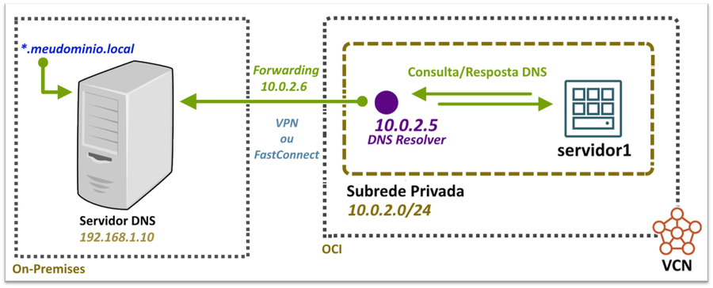

Nesta comunicação, o endereço IP do Forwarding se torna o cliente. Isso quer dizer que a conexão com destino ao on-premises, tem como origem o endereço IP do Forwarding (`10.0.2.6`).

Além do on-premises, o Forwarding é também configurado dessa maneira quando se quer resolver nomes dos recursos de uma outra região.

## Casos de Uso

### Cenário #1 - Resolução de nomes via "conditional forwarding"

Este é o primeiro cenário de exemplo que demonstra a resolução de nomes entre on-premises e cloud.

Observe o desenho abaixo:

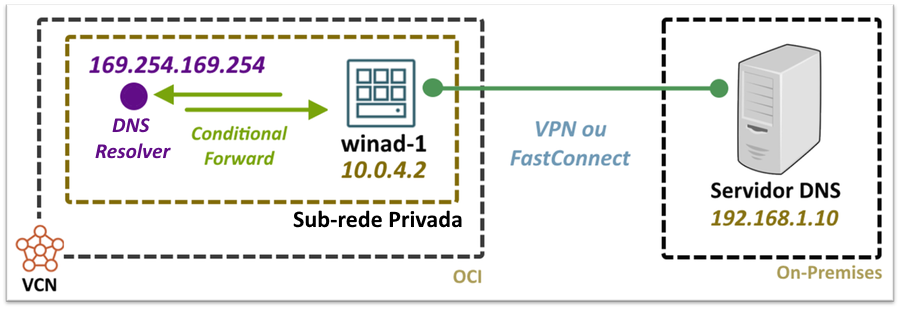

Do lado do OCI, há um servidor DNS secundário (winad-1) que necessita também de resolver os nomes da cloud. Através da configuração do "conditional forwarding", é possível direcionar as consultas do domínio `oraclevcn.com` para o DNS Resolver `169.254.169.254`:

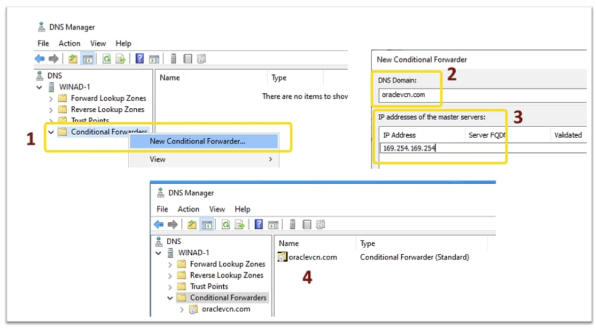

Após essa configuração, o servidor DNS `10.0.4.2` já consegue resolver os nomes contidos na cloud:

```powershell
C:\>nslookup - 10.0.4.2
Default Server: UnKnown
Address: 10.0.4.2

> winad-1.subnprv3.vcna.oraclevcn.com
Server: UnKnown
Address: 10.0.4.2

Non-authoritative answer:
Name: winad-1.subnprv3.vcna.oraclevcn.com
Address: 10.0.4.2
```

### Cenário #2 - Resolução de nomes On-Premises e OCI

Observe a imagem de exemplo abaixo:

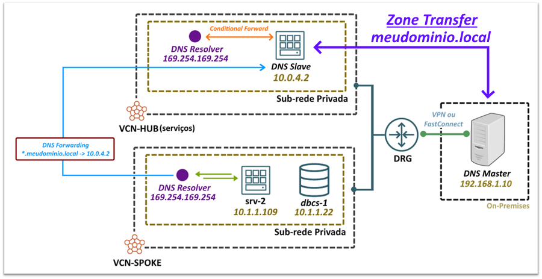

Este é um cenário típico onde já existe um servidor DNS Master (primário) do lado do on-premises, e um servidor DNS Slave (secundário) no OCI. O objetivo final é possibilitar a resolução de nomes de ambos os ambientes (cloud e on-premises), até porque existem aplicações no on-premises que necessitam acessar o banco de dados (dbcs-1) existente na cloud.

Um detalhe importante. Para obter alta disponibilidade e escalabilidade, todo acesso ao banco de dados que é formado por um ou mais servidores (_[RAC – Real Application Clusters](https://www.oracle.com/br/database/real-application-clusters/)_), deve ser via nome _[SCAN (Single Client Access Names)](https://docs.oracle.com/database/121/JJDBC/scan.htm#JJDBC29151)_ e nunca diretamente por um endereço IP:

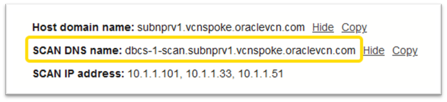

O primeiro item é a configuração do "conditional forwarding" no DNS Slave. Para resolver qualquer nome do domínio `oraclevcn.com`, a solicitação deve ser repassada para o DNS Resolver da sub-rede (`169.254.169.254`):

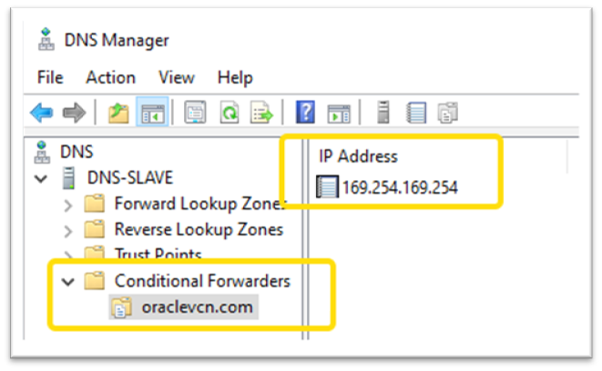

Em seguida, associa-se a Private View da VCN-SPOKE à VCN-HUB:

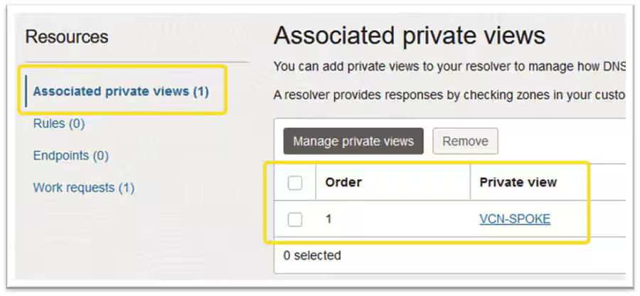

Essa configuração já possibilita a resolução do _[SCAN](https://docs.oracle.com/database/121/JJDBC/scan.htm#JJDBC29151)_ a partir do DNS Slave:

```powershell
C:\>nslookup - 10.0.4.2
Default Server: UnKnown
Address: 10.0.4.2

> dbcs-1-scan.subnprv1.vcnspoke.oraclevcn.com
Server: UnKnown
Address: 10.0.4.2

Non-authoritative answer:
Name: dbcs-1-scan.subnprv1.vcnspoke.oraclevcn.com
Addresses: 10.1.1.51
10.1.1.33
10.1.1.101
```

No DNS Master, o "conditional forwarding" para o domínio `oraclevcn.com`, deve usar o endereço IP do DNS Slave (`10.0.4.2`):

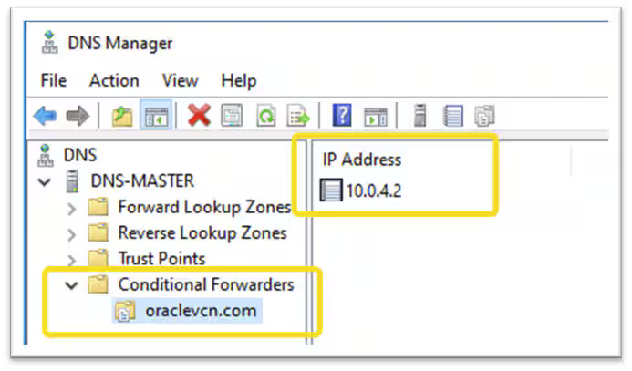

Feitos essas configurações, é possível agora simplificar a resolução do _[SCAN](https://docs.oracle.com/database/121/JJDBC/scan.htm#JJDBC29151)_ para um nome que pertence ao domínio `meudominio.local`, que já é existente no on-premises:

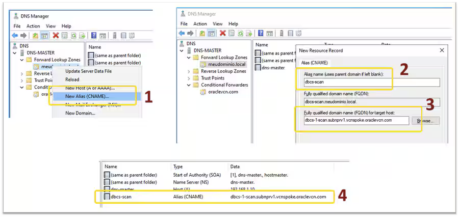

Pronto! A partir de agora o on-premises resolve corretamente o _[SCAN](https://docs.oracle.com/database/121/JJDBC/scan.htm#JJDBC29151)_ do banco de dados de exemplo:

```powershell
C:\>nslookup - 192.168.1.10
Default Server: UnKnown
Address: 192.168.1.10

> dbcs-scan.meudominio.local
Server: UnKnown
Address: 192.168.1.10

Name: dbcs-1-scan.subnprv1.vcnspoke.oraclevcn.com
Addresses: 10.1.1.33
10.1.1.101
10.1.1.51
Aliases: dbcs-scan.meudominio.local
```

Por último, se houver a necessidade dos recursos da VCN-SPOKE em resolver os nomes do domínio `meudominio.local`, basta a configuração de uma regra que utiliza um endpoint do tipo _Forwarding_ no DNS Resolver da VCN-SPOKE:

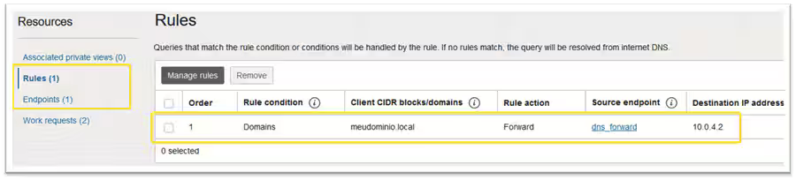

Abaixo, um teste a partir do SRV-2 (`10.1.1.109`):

```shell
[opc@srv-2 ~]$ nslookup dbcs-scan.meudominio.local
Server: 169.254.169.254
Address: 169.254.169.254#53

Non-authoritative answer:
dbcs-scan.meudominio.local canonical name =
dbcs-1-scan.subnprv1.vcnspoke.oraclevcn.com.
Name: dbcs-1-scan.subnprv1.vcnspoke.oraclevcn.com
Address: 10.1.1.51
Name: dbcs-1-scan.subnprv1.vcnspoke.oraclevcn.com
Address: 10.1.1.101
Name: dbcs-1-scan.subnprv1.vcnspoke.oraclevcn.com
Address: 10.1.1.33
```

### Cenário #3 - Resolução de nomes multi-região

Para o último cenário de exemplo, temos duas regiões distintas (`sa-saopaulo-1` e `sa-vinhedo-1`) conectadas por um _[RPC (Remote Peering Connection)](https://docs.oracle.com/en-us/iaas/Content/Network/Tasks/scenario_e.htm)_.

Observe a imagem abaixo e note que a região de Vinhedo (`sa-vinhedo-1`) foi escolhida para _Recuperação de Desastre (DR – Disaster Recovery)_:

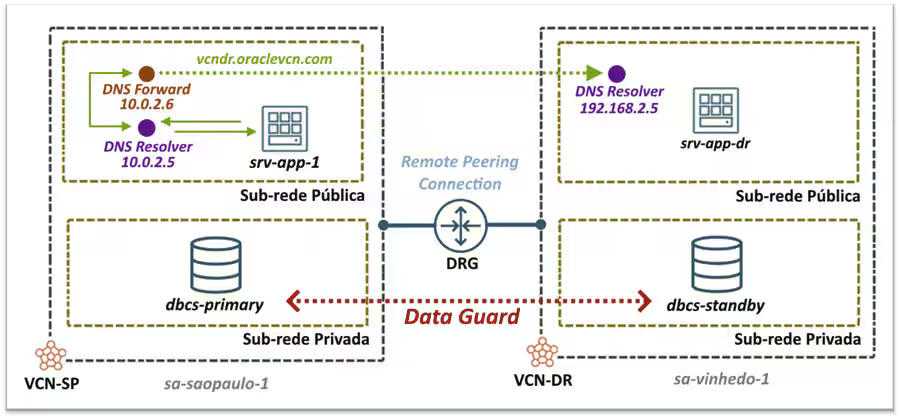

No exemplo, temos duas VCNs em cada região. Um banco de dados primário (dbcs-primary) em São Paulo (`sa-saopaulo-1`) e sua versão standby (dbcs-standby) em Vinhedo (`sa-vinhedo-1`). Há um _[Data Guard](https://docs.oracle.com/pt-br/iaas/dbcs/doc/use-oracle-data-guard-db-system.html)_ configurado entre os bancos que garante a alta disponibilidade e recuperação rápida, caso exista qualquer problema na região de São Paulo.

O objetivo final é poder, de maneira correta, resolver os nomes dos recursos existentes em ambas as _[regiões](https://docs.oracle.com/pt-br/iaas/Content/General/Concepts/regions.htm)_.

A VCN-SP existente na região de São Paulo (`sa-saopaulo-1`), possui o domínio `vcnsp.oraclevcn.com` para os seus recursos. Já a VCN-DR em Vinhedo (`sa-vinhedo-1`), possui o domínio `vcndr.oraclevcn.com`.

Começarei pelo DNS Resolver da VCN-SP, criando um endpoint do tipo Listening e outro do tipo Forwarding:

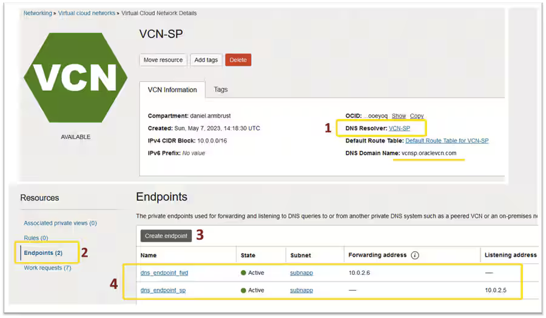

O mesmo procedimento é feito para a VCN-DR na região de Vinhedo:

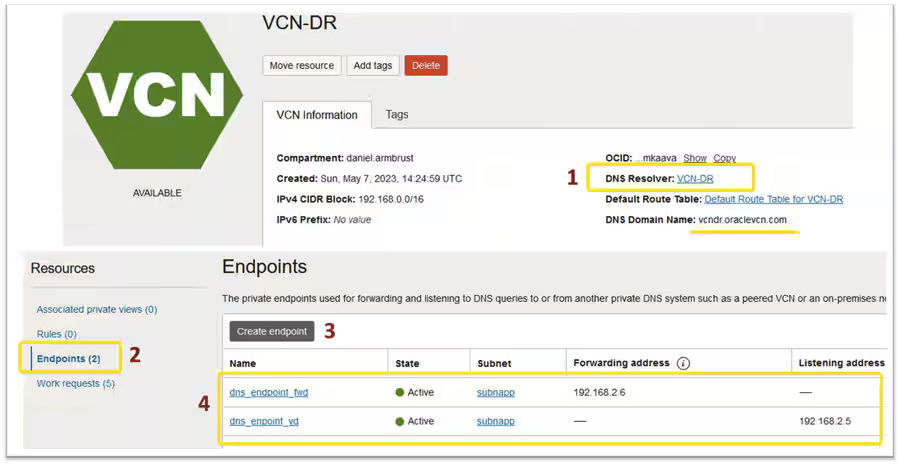

De volta em VCN-SP, será configurado uma regra para resolução de qualquer nome do domínio `vcndr.oraclevcn.com` que utiliza o endpoint Listening da VCN-DR (`192.168.2.5`):

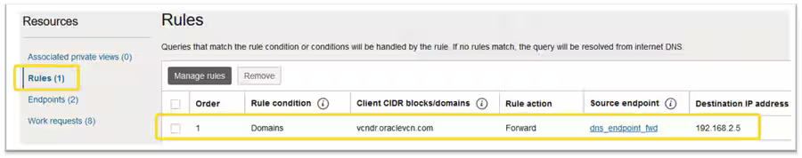

Na VCN-DR, o procedimento é o mesmo só mudando para o domínio `vcnsp.oraclevcn.com` e o endpoint Listening da VCN-SP (`10.0.2.5`): 

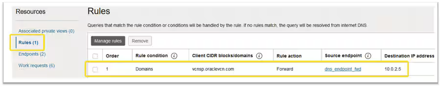

O teste será resolver o nome _[SCAN](https://docs.oracle.com/database/121/JJDBC/scan.htm#JJDBC29151)_ do banco de dados (dbcs-standby) localizado na VCN-DR a partir da VCN-SP:

```shell
[opc@srv-app-1 ~]$ nslookup dbcs-standby-scan.subndr.vcndr.oraclevcn.com
Server: 169.254.169.254
Address: 169.254.169.254#53

Non-authoritative answer:
Name: dbcs-standby-scan.subndr.vcndr.oraclevcn.com
Address: 192.168.1.247
Name: dbcs-standby-scan.subndr.vcndr.oraclevcn.com
Address: 192.168.1.88
Name: dbcs-standby-scan.subndr.vcndr.oraclevcn.com
Address: 192.168.1.24
```

Para finalizar é possível através do DNS Privado, criar a zona `meudominio.local` com os seus devidos registros. O exemplo abaixo demonstra a criação do registro do tipo CNAME `scan-dr.meudominio.local`:

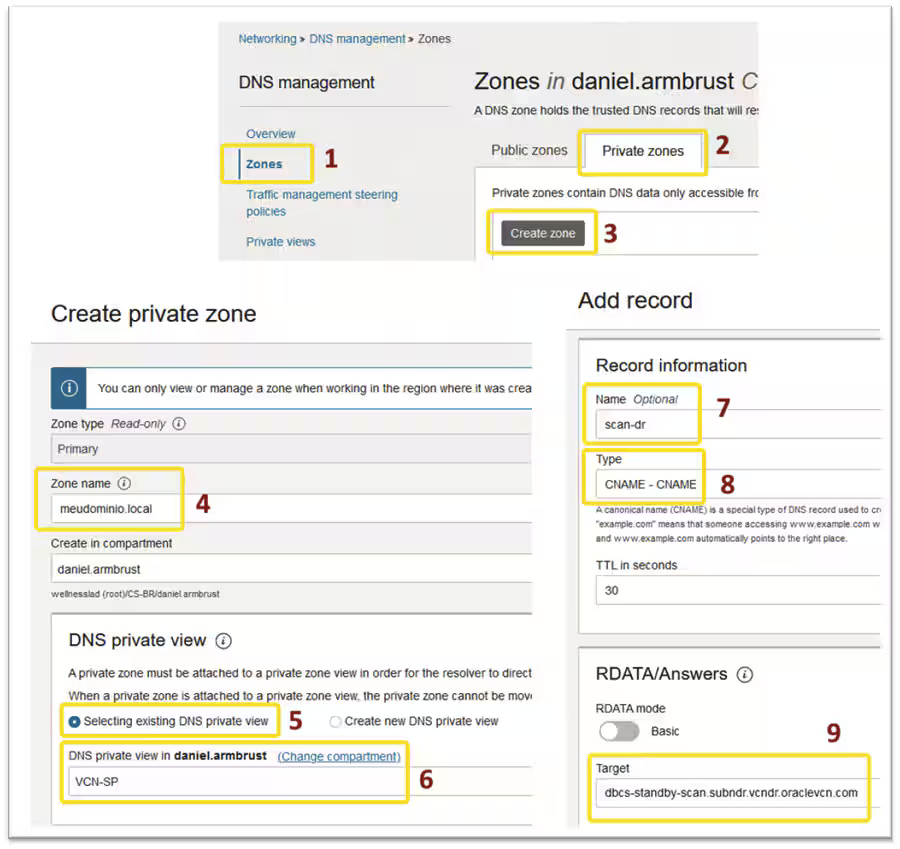

```shell
[opc@srv-app-1 ~]$ nslookup scan-dr.meudominio.local
Server: 169.254.169.254
Address: 169.254.169.254#53

Non-authoritative answer:
scan-dr.meudominio.local canonical name =
dbcs-standby-scan.subndr.vcndr.oraclevcn.com.
Name: dbcs-standby-scan.subndr.vcndr.oraclevcn.com
Address: 192.168.1.88
Name: dbcs-standby-scan.subndr.vcndr.oraclevcn.com
Address: 192.168.1.24
Name: dbcs-standby-scan.subndr.vcndr.oraclevcn.com
Address: 192.168.1.247
```

## DNS Recursivo, público e gratuito

A Oracle, igual a outros provedores, possui um serviço de _[DNS Recursivo](https://docs.oracle.com/pt-br/iaas/Content/DNS/Concepts/recursive-dns.htm)_ público e gratuito. Se você precisa de um DNS para resolver nomes da Internet pública, convido você a utilizar os seguintes endereços:

- **216.146.35.35**
- **216.146.36.36**

```shell
[opc@srv-app-1 ~]$ nslookup - 216.146.35.35
> registro.br
Server: 216.146.35.35
Address: 216.146.35.35#53

Non-authoritative answer:
Name: registro.br
Address: 200.160.2.3
Name: registro.br
Address: 2001:12ff:0:2::3
```