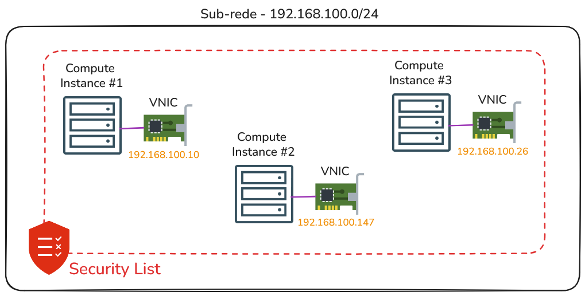
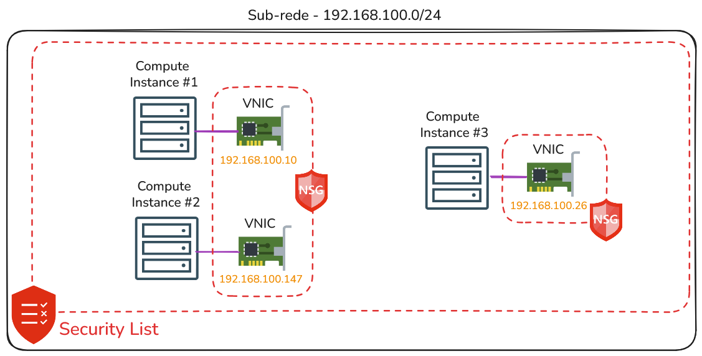

# Firewall e Conntrack Table

## Security List vs. Network Security Group

O serviço de rede do OCI disponibiliza dois tipos de firewalls, nas camadas 3 e 4 do modelo OSI, para controle de tráfego de entrada (ingress) e saída (egress). O funcionamento de ambos é idêntico: todo tráfego é bloqueado por padrão até que encontre uma regra que permita sua passagem (ALLOW). São eles:

### Security List

Esse é o firewall associado à sub-rede e aplicado a todas as suas VNICs. Como resultado, todo o tráfego de entrada (ingress) e saída (egress) é inspecionado com base nas regras definidas na Security List.



Toda sub-rede deve ter pelo menos uma security list e pode ter no máximo, cinco security lists empilhadas. Nesse caso, todas as Security Lists são avaliadas em conjunto na busca por uma regra que permita o tráfego (ALLOW).

```bash
$ oci network security-list update \
> --security-list-id "ocid1.securitylist.oc1.sa-saopaulo-1.aaaaaaaa" \
> --ingress-security-rules '[{
>   "protocol": "6",
>   "source": "0.0.0.0/0",
>   "tcpOptions": {
>       "destinationPortRange": {
>          "min": 80,
>          "max": 80
>       }
>   }
> }]' \
> --force
```

### Network Security Group (NSG)

Este é o firewall que pode ser associado a uma VNIC ou a um grupo de VNICs. Nesse caso, a inspeção do tráfego é realizada no nível da VNIC, permitindo que cada VNIC possua suas próprias regras exclusivas para controle do tráfego.



```bash
$ oci network nsg create \
> --compartment-id "ocid1.compartment.oc1..aaaaaaaa" \
> --vcn-id "ocid1.vcn.oc1.sa-saopaulo-1.aaaaaaaa" \
> --display-name "web-nsg"
```

```bash
$ oci network nsg rules add \
> --nsg-id "ocid1.networksecuritygroup.oc1.sa-saopaulo-1.aaaaaaaa" \
> --security-rules '[{
>    "direction": "INGRESS",
>    "protocol": "6",
>    "source": "0.0.0.0/0",
>    "tcpOptions": {
>       "destinationPortRange": {
>          "min": 80,
>          "max": 80
>       }
>    }
> }]'
```

```bash
$ oci network vnic update \
> --vnic-id ocid1.vnic.oc1.sa-saopaulo-1.aaaaaaaa \
> --nsg-ids '["ocid1.networksecuritygroup.oc1.sa-saopaulo-1.aaaaaaaa"]' \
> --force
```

## Conntrack Table

Toda regra de segurança que for criada, seja uma regra de Security List ou Network Security Group (NSG), pode ser definida como sendo do tipo **Stateful** ou **Stateless**. Por padrão, as regras são criadas como **Stateful**.

Uma regra **Stateful** utiliza uma funcionalidade chamada **Connection Tracking**, que mantém informações sobre as conexões permitidas pelas Security Lists ou Network Security Groups (NSG).

Por exemplo, suponha que exista uma regra em uma Security List que permita tráfego de qualquer origem (0.0.0.0/0) com destino à porta 80/TCP. Após esse tráfego ser inspecionado e permitido, a Security List armazena em uma espécie de **buffer**, mais precisamente, em uma **tabela**, informações como o IP de origem, porta e protocolo de origem, IP de destino, porta e protocolo de destino (dados do **socket da conexão**). Essa tabela é chamada de **Conntrack Table**.

A Conntrack Table, no exemplo mencionado, é consultada quando há tráfego de retorno, ou seja, quando o recurso computacional envia uma resposta. Nesse momento, a Security List utiliza essa tabela para permitir automaticamente o tráfego de volta ao originador. Dessa forma, não é necessário avaliar as regras de egress para a resposta. Diz-se, então, que a Security List mantém o _"estado da conexão"_ através da sua Conntrack Table, ou seja, realiza o **Connection Tracking**.

Já as regras do tipo **Stateless** não há **Conntrack Table** e, portanto, não existe limite ou tabela que mantém o estado das conexões. No entanto, para cada regra de entrada (ingress), é necessário definir também uma regra de saída (egress). Em outras palavras, é preciso configurar regras que permitam tanto o tráfego de entrada quanto o de saída (ida e volta). Do ponto de vista administrativo, configurar regras do tipo **Stateless** é mais trabalhoso, pois exige a definição de um maior número de regras.

A recomendação geral é: **utilize regras do tipo Stateless em sub-redes que hospedam firewalls, load balancers públicos ou qualquer sub-rede que possa ter (ou tenha) alto volume de tráfego.**

## Compute Instance Firewall