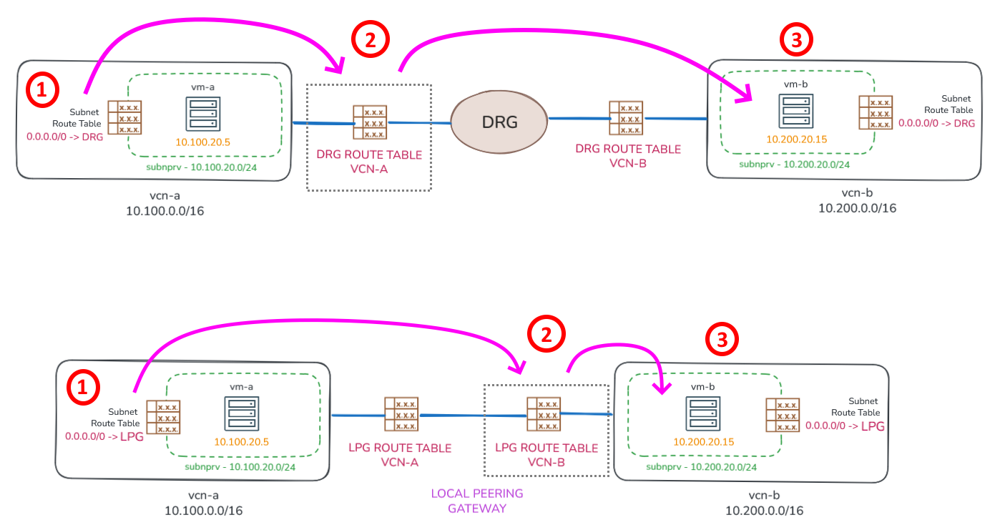
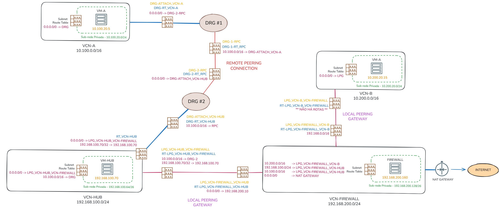

# Hub & Spoke com Local Peering Gateway (LPG)

## Local Peering Gateway (LPG)

O _[Local Peering Gateway (LPG)](https://docs.oracle.com/en-us/iaas/Content/Network/Tasks/localVCNpeering.htm)_ é utilizado para conectar duas VCNs diretamente. 

Hoje, já não é mais recomendado utilizar LPGs para conectar VCNs pois, a função que o LPG desempenha foi substituída pelo _[DRG](https://docs.oracle.com/en-us/iaas/Content/Network/Tasks/managingDRGs.htm)_, que é o modo atualmente recomendado para se construír topologias de redes no OCI.

EU particularmente, ainda vejo diversas topologias que utilizam LPGs para interconectar VCNs. Por esse motivo, considero importante compreender como o roteamento funciona quando existe um LPG realizando a comunicação entre as VCNs.

## DRG vs. LPG

Além da forma utilizada para estabelecer a conectividade, as decisões de roteamento realizadas através do DRG diferem das utilizadas em cenários com LPG. Observe o diagrama abaixo:

No caso do DRG, a decisão de roteamento ocorre quando o pacote sai da VCN e entra no DRG. Nesse momento, é consultada a tabela de rotas associada ao anexo responsável pela conexão entre a VCN e o DRG.

Já no cenário com LPG, existem duas tabelas de rotas, uma em cada extremidade da conexão, que podem ou não existir. Nesse modelo, a decisão de roteamento ocorre quando o pacote sai da VCN de origem e entra na VCN de destino.

Sim, com o LPG é possível definir uma tabela de rotas para cada extremidade da conexão. No exemplo, existe uma tabela de rotas aplicada para os pacotes que entram na `vcn-a` e outra para os pacotes que entram na `vcn-b`. 

Mas vale lembrar que essas tabelas de rotas associadas ao LPG só fazem sentido quando há a necessidade de desviar ou direcionar o tráfego para destinos específicos após a entrada do pacote na VCN de destino. Caso contrário, não é necessário associar nenhuma tabela, pois o próprio LPG já realiza automaticamente a divulgação das redes das VCNs conectadas.

## Fluxo de Roteamento

Observe o diagrama abaixo, que ilustra o fluxo de roteamento entre os recursos de rede da topologia de exemplo:

Suponha que a compute instance `vm-a` (`10.100.20.5`) precise se comunicar com a compute instance `vm-b` (`192.168.200.160`). As decisões de roteamento da origem para o destino, que fazem o tráfego passar pelo compute instance `firewall` (`192.168.200.160`), são:

1. A primeira decisão de roteamento ocorre no próprio host `10.100.20.5`. Nessa etapa o host determina o endereço IP e a interface de rede que será usada para enviar o tráfego. Normalmente existe uma **rota default** apontando para o gateway da sub‑rede (`10.100.20.1`).

2. Após o gateway da sub-rede (`10.100.20.1`) decidir que o pacote deve ser encaminhado ao DRG, a segunda decisão de roteamento ocorre quando o pacote entra no `drg-1`. Nesse momento, o DRG consulta a tabela de rotas `drg-rt_vcn`. Essa tabela possui um **Import Route Distribution** que instala todas as rotas divulgadas pelo **Remote Peering Connection**.

3. A terceira decisão de roteamento ocorre quando o pacote está prestes a entrar no `drg-2`, onde a tabela `drg-rt_rpc` é consultada. Essa tabela possui um **Import Route Distribution** que instala todas as rotas de todas as redes conectadas ao `drg-2` (**MATCH ALL**).

4. A quarta decisão de roteamento ocorre quando o pacote entra na `vcn-hub`, onde a tabela de rotas `rt_vcn-hub` passa a ser consultada. Nessa tabela existe uma **rota default** (`0.0.0.0/0`) que direciona todo o tráfego para o LPG `lpg_vcn-hub_vcn-firewall`, no qual conecta as VCNs `vcn-hub` à `vcn-firewall`. Entretanto, essa **rota default** não possui efeito para comunicações destinadas à própria `vcn-hub` (`192.168.100.0/24`). Isso significa que, caso o destino da `vm-a` for `vm-hub`, não é necessário que a tabela `rt_vcn-hub` contenha uma rota explícita para a rede `192.168.100.0/24` (há um roteamento implícito neste caso).

5. A quinta decisão de roteamento ocorre quando o pacote entra na `vcn-firewall` através do **Local Peering Gateway**. Nesse momento, a tabela de rotas `rt-lpg_vcn-firewall_vcn-hub` é consultada onde existe uma **rota default** (`0.0.0.0/0`) que direciona todo o tráfego para o endereço IP do `firewall` (`192.168.200.160`).

6. A compute instance `firewall` realiza a inspeção do tráfego e, caso a comunicação seja permitida, encaminha o pacote para o gateway da sua sub-rede (`192.168.200.129`). A tabela de rotas do host `firewall` é simples, contendo apenas uma **rota default** apontando para o respectivo gateway da sub-rede.

7. A sétima decisão de roteamento ocorre no gateway da sub-rede `192.168.200.129`. Nesse momento, a tabela de rotas associada à sub-rede é consultada. Essa tabela deve conter rotas específicas para as redes internas do OCI, pois existe uma **rota default** que direciona o tráfego para o **NAT Gateway** (tráfego destinado à Internet). Isso significa que todas as redes do OCI para as quais o `firewall` precise acessar devem estar explicitamente definidas nessa tabela caso contrário, o tráfego será encaminhado ao **NAT Gateway**.

8. A oitava decisão de roteamento ocorre quando o tráfego está prestes a entrar na `vcn-b` através do **Local Peering Gateway**, onde a tabela de rotas `rt-lpg_vcn-b_vcn-firewall` é consultada. Essa tabela não possui nenhuma rota definida e, neste caso, o próprio **Local Peering Gateway** realiza automaticamente a divulgação das redes das VCNs conectadas, não sendo necessário definir qualquer regra de roteamento.

9. Por fim, o pacote entra na compute instance `vm-b` onde é processado pela aplicação de destino. Após o processamento, o tráfego de resposta é encaminhado ao gateway da sua respectiva sub-rede (`10.200.20.1`) para iniciar o caminho de retorno até a origem.

O tráfego de retorno, ou seja, a resposta da compute instance `vm-b` (`10.200.20.15`) para `vm-a` (`10.100.20.5`), segue o mesmo fluxo de decisões de roteamento descrito anteriormente, em sentido inverso.