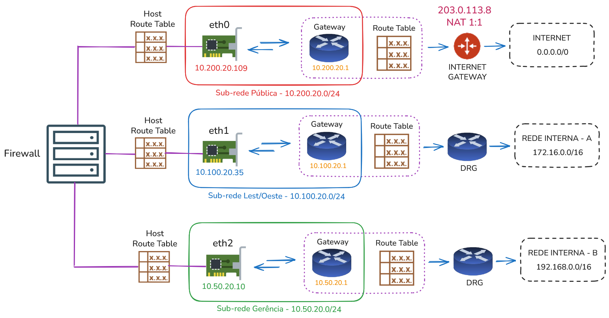

# Nota sobre VNICs

VNIC (Virtual Network Interface Card), nada mais é do que uma interface de rede lógica associada a uma interface de rede (NIC). Uma VNIC reside em uma sub-rede e é responsável por permitir que uma instância computacional se comunique com a rede. Ou seja, todo recurso computacional que possui conectividade de rede está possui pelo menos uma VNIC.

Algumas notas sobre VNICs, extraídas da documentação oficial _["Virtual Network Interface Cards (VNICs)"](https://docs.oracle.com/en-us/iaas/Content/Network/Tasks/managingVNICs.htm#overview)_ e complementadas pela minha experiência, que considero importantes, são:

1. Um recurso computacional que se comunica com a rede sempre possui uma VNIC do tipo **primária**, a qual não pode ser removida ou substituída.

2. VNICs secundárias podem ser adicionadas e podem residir na mesma sub-rede do recurso computacional ou em uma sub-rede diferente. 

3. Quando o recurso computacional é excluído, suas VNICs também são excluídas automaticamente.

4. A quantidade máxima de VNICs que um recurso computacional pode ter está relacionada à quantidade de OCPUs. Inicialmente, 1 OCPU inclui 2 VNICs; para as demais, considera-se 1 VNIC adicional por OCPU. Por exemplo, um compute com 4 OCPUs pode ter, no máximo, 5 VNICs.

5. O shape do recurso computacional também pode influenciar a quantidade máxima de VNICs. Em shapes do tipo Bare Metal, essa quantidade normalmente não está diretamente associada ao número de OCPUs. Por exemplo, o shape **BM.Standard.E5.192** possui 192 OCPUs e permite até 256 VNICs.

6. A largura de banda máxima de uma VNIC está associada à quantidade de OCPUs do recurso computacional, sendo que cada OCPU representa aproximadamente 1 Gbps. Por exemplo, 4 OCPUs permitem uma largura de banda máxima de 4 Gbps.

7. A largura de banda total é compartilhada entre as VNICs. Ou seja, um recurso computacional com 3 VNICs e 4 OCPUs possui um total de 4 Gbps, compartilhado entre todas as VNICs.

8. Shapes do tipo Bare Metal possuem maior largura de banda. Por exemplo, o shape BM.Standard.A1.160 possui dois canais dedicados de 50 Gbps cada.

9. Dependendo do sistema operacional, especialmente em shapes Bare Metal, há limites diferentes de VNICs. Por exemplo, o shape BM.DenseIO.E5.128 suporta até 256 VNICs para Linux e 129 para Windows.

10. Toda VNIC possui um endereço IP privado primário que não pode ser alterado ou removido.

11. O endereço IP privado da VNIC é o endereço visível na interface de rede do host. 

12. Caso a VNIC possua um endereço IP público, ele é tratado em uma camada do OCI. Assim, o IP público não aparece na interface de rede do host (há um NAT 1:1 realizado pelo OCI).

13. Uma VNIC pode ter até 64 endereços IPv4 privados secundários (atribuídos via DHCP da sub-rede). Para IPv6, o limite é de 32 endereços.

14. Para cada endereço IP privado, é possível associar um endereço IP público.

15. Endereços IP públicos podem ser reservados ou efêmeros.

16. Cada VNIC pode ser associada a regras de firewall exclusivas por meio de [Network Security Groups (NSG)](https://docs.oracle.com/en-us/iaas/Content/Network/Concepts/networksecuritygroups.htm).

17. Uma VNIC pode ter sua própria tabela de rotas. Nesse caso, a decisão de roteamento ocorre no nível da VNIC, e a tabela de rotas da sub-rede não é utilizada.

18. Um hostname opcional pode ser definido para uma VNIC.

19. VLAN tags podem ser configuradas, porém seu uso é mais comum em ambientes como o [Oracle Cloud VMware (OCVS)](https://docs.oracle.com/en-us/iaas/Content/VMware/Concepts/ocvsoverview.htm).

20. **Source/Destination Check** é um mecanismo de segurança presente nas VNICs que garante que a instância envie e receba apenas tráfego cujo IP de origem ou destino seja o da própria VNIC. Para instâncias que atuam como firewall ou roteador, esse recurso deve ser desabilitado.

## VNICs em Múltiplas Sub-redes

Considere o exemplo ilustrado a seguir:

Como já mencionado, é possível ter múltiplas VNICs em um compute instance, sendo esse tipo de configuração bastante comum em cenários de firewall. Um ponto importante é que a VNIC é um recurso vinculado a um Availability Domain (AD). Isso significa que todas as VNICs associadas a um compute instance devem estar no mesmo Availability Domain. Não é possível, por exemplo, que uma instância tenha uma VNIC no AD-1 e outra no AD-2, por exemplo.

