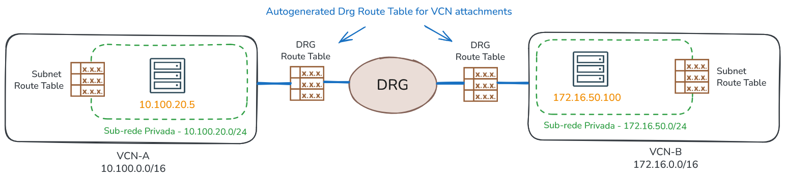
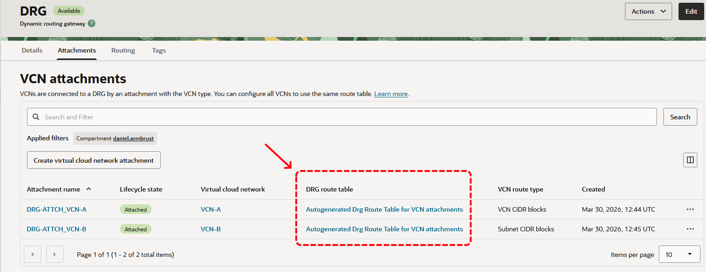
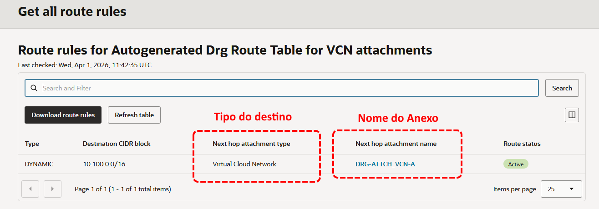

# Roteamento Avançado

## Roteamento por meio do DRG

O [DRG (Dynamic Routing Gateway)](https://docs.oracle.com/en-us/iaas/Content/Network/Tasks/managingDRGs.htm) é um componente responsável por possibilitar a conectividade e realizar o roteamento entre VCNs, seja na mesma região ou entre regiões diferentes. Além disso, ele permite a conectividade privada com ambientes on-premises, por meio do FastConnect ou do serviço de VPN Site-to-Site.

Será utilizado o desenho abaixo para ilustrar o funcionamento do roteamento no DRG.



Para criar o DRG, utiliza-se o comando a seguir:

```bash
$ oci network drg create \
> --compartment-id "ocid1.compartment.oc1..aaaaaaaa" \
> --display-name "DRG"
```

Em seguida, é necessário conectar as VCNs ao DRG. No contexto do DRG, essa ação de "conectar" é chamada **anexar (attach)** e pode ser realizada por meio do comando abaixo:

```bash
$ oci network drg-attachment create \
> --drg-id "ocid1.drg.oc1.sa-saopaulo-1.aaaaaaaa" \
> --vcn-id "ocid1.vcn.oc1.sa-saopaulo-1.amaaaaaa" \
> --display-name "DRG-ATTCH_VCN-A"
```

```bash
$ oci network drg-attachment create \
> --drg-id "ocid1.drg.oc1.sa-saopaulo-1.aaaaaaaa" \
> --vcn-id "ocid1.vcn.oc1.sa-saopaulo-1.bbbbbbbb" \
> --display-name "DRG-ATTCH_VCN-B"
```

Não apenas VCNs podem ser anexadas ao DRG, mas também outros recursos de rede. Entre os mais comuns estão o **FastConnect (Virtual Circuit attachments)**, a **VPN Site-to-Site (IPSec Tunnel attachments)** e o **Remote Peering Connection (RPC attachments)**, que permite a conexão entre dois DRGs, seja na mesma região ou em regiões diferentes.

### DRG Route Table

Ao anexar uma VCN ao DRG, o anexo passa automaticamente a utilizar a tabela de rotas padrão denominada **Autogenerated DRG Route Table for VCN Attachments**. Essa tabela é criada no momento da criação do DRG e, por padrão, é associada a todas as VCNs anexadas a ele.



Já no caso do FastConnect, da VPN Site-to-Site ou do Remote Peering Connection (RPC), ao serem anexados ao DRG, a tabela de rotas padrão utilizada é a **Autogenerated Drg Route Table for RPC, VC, and IPSec attachments**.

As tabelas de rotas do DRG tem um funcionamento diferente em comparação às tabelas de rotas das sub-redes. A principal diferença é que as regras de roteamento sempre têm como destino um outro anexo. Isso significa que não é possível definir um next-hop que aponte diretamente para um endereço IP, por exemplo.



as rotas podem ser inseridas dinamicamente por meio de um recurso chamado **Import Route Distribution**.

O outro detalhe 

O outro detalhe é que o next-hop é sempre 

**Import Route Distribution** permite importar ou instalar rotas de outros anexos. 

