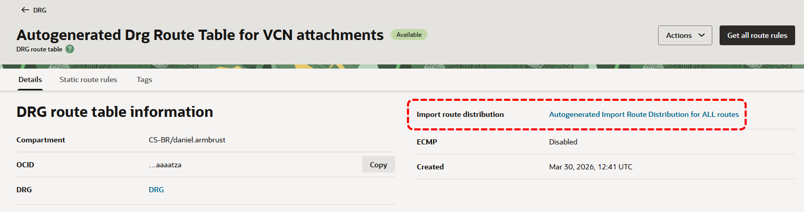
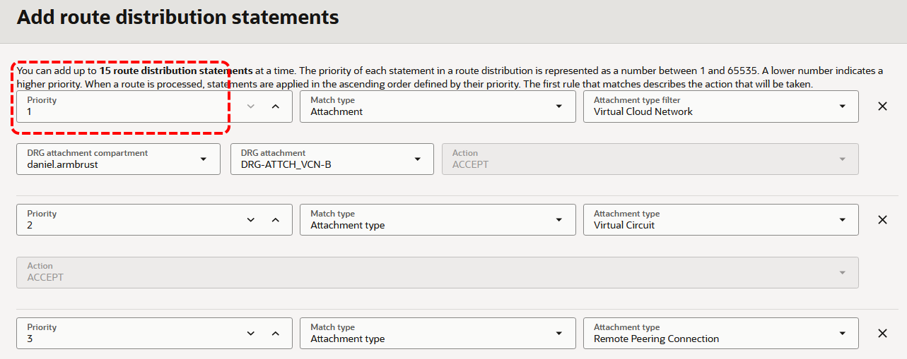
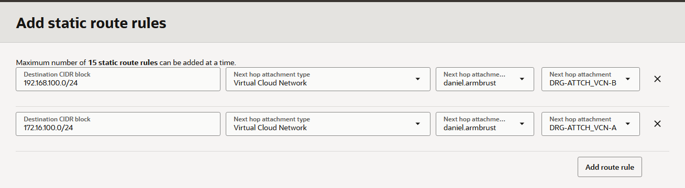

# Roteamento Avançado

## DRG (Dynamic Routing Gateway)

O [DRG (Dynamic Routing Gateway)](https://docs.oracle.com/en-us/iaas/Content/Network/Tasks/managingDRGs.htm) é um componente responsável por possibilitar a conectividade e realizar o roteamento entre VCNs, seja na mesma região ou entre regiões diferentes. Além disso, ele permite a conectividade privada com ambientes on-premises, por meio do FastConnect ou do serviço de VPN Site-to-Site.

Será utilizado o desenho abaixo para ilustrar o funcionamento do roteamento no DRG.


Para criar o DRG, utiliza-se o comando a seguir:

```bash
$ oci network drg create \
> --compartment-id "ocid1.compartment.oc1..aaaaaaaa" \
> --display-name "DRG"
```

Em seguida, é necessário conectar as VCNs ao DRG. No contexto do DRG, essa ação de "conectar" é chamada **anexar (attach)** e pode ser realizada por meio do comando abaixo:

```bash
$ oci network drg-attachment create \
> --drg-id "ocid1.drg.oc1.sa-saopaulo-1.aaaaaaaa" \
> --vcn-id "ocid1.vcn.oc1.sa-saopaulo-1.amaaaaaa" \
> --display-name "DRG-ATTCH_VCN-A"
```

```bash
$ oci network drg-attachment create \
> --drg-id "ocid1.drg.oc1.sa-saopaulo-1.aaaaaaaa" \
> --vcn-id "ocid1.vcn.oc1.sa-saopaulo-1.bbbbbbbb" \
> --display-name "DRG-ATTCH_VCN-B"
```

Não apenas VCNs podem ser anexadas ao DRG, mas também outros recursos de rede. Entre os mais comuns estão o **FastConnect (Virtual Circuit attachments)**, a **VPN Site-to-Site (IPSec Tunnel attachments)** e o **Remote Peering Connection (RPC attachments)**, que permite a conexão entre dois DRGs, seja na mesma região ou em regiões diferentes.

### DRG Route Table e Import Route Distribution

Ao anexar uma VCN ao DRG, o anexo passa automaticamente a utilizar a tabela de rotas padrão denominada **Autogenerated DRG Route Table for VCN Attachments**. Essa tabela é criada no momento da criação do DRG e, por padrão, é associada a todas as VCNs anexadas a ele.


Já no caso do FastConnect, da VPN Site-to-Site ou do Remote Peering Connection (RPC), ao serem anexados ao DRG, a tabela de rotas padrão utilizada é a **Autogenerated Drg Route Table for RPC, VC, and IPSec attachments**.

As tabelas de rotas do DRG tem um funcionamento diferente em comparação às tabelas de rotas das sub-redes. A principal diferença é que as regras de roteamento sempre têm como destino um outro anexo. Isso significa que não é possível definir um next-hop que aponte diretamente para um endereço IP, por exemplo.


Outro aspecto importante é que as rotas podem ser inseridas dinamicamente através de um recurso chamado **Import Route Distribution**. Assim, uma tabela de rotas do DRG pode incluir um **Import Route Distribution**, que permitirá a instalação dinâmica das redes de outros anexo(s).

Na imagem abaixo, é possível ver que a tabela **Autogenerated DRG Route Table for VCN Attachments** utiliza o recurso de importação de rotas chamado **Autogenerated Import Route Distribution for ALL routes**.



Por padrão, o DRG inclui dois **Import Route Distribution**, que são:

- **Autogenerated Import Route Distribution for ALL routes**
    - Usado automaticamente pela tabela de rotas **Autogenerated DRG Route Table for VCN Attachments**.

- **Autogenerated Import Route Distribution for VCN Routes**
    - Usado automaticamente pela tabela de rotas **Autogenerated Drg Route Table for RPC, VC, and IPSec attachments**

Um **Import Route Distribution** pode incluir as seguintes declarações:

- **Match all**
    - Importa as redes de todos os anexos.

- **Attachment**
    - Possibilita a importação das redes de um anexo específico. Por exemplo, é possível importar as redes exclusivamente do anexo DRG-ATTCH_VCN-B para o anexo DRG-ATTCH_VCN-A.

- **Attachment type**
    - Permite a importação das redes de um determinado tipo de anexo. Por exemplo, é possível importar as redes do tipo **Virtual Circuit** para o anexo DRG-ATTCH_VCN-A. Dessa maneira, as redes divulgadas do ambiente On-Premises por meio do FastConnect serão importadas para o anexo DRG-ATTCH_VCN-A.

A ordem de importação das redes é gerenciada pelo parâmetro **Priority**, onde um número menor indica uma maior prioridade. As prioridades são processadas em ordem crescente, portanto, **redes com um número de prioridade menor serão processadas primeiro**.

Na imagem abaixo, as redes do anexo DRG-ATTCH_VCN-B serão importadas primeiro para a tabela de rotas, seguidas pelas redes de todos os anexos do tipo Virtual Circuit e logo após, as redes do anexo do tipo Remote Peering Connection.



Além das rotas dinâmicas que podem ser importadas por meio do **Import Route Distribution**, as tabelas de roteamento do DRG também oferecem a opção de utilizar rotas estáticas. Vale lembrar que o next-hop nas tabelas do DRG deve ser sempre um anexo.



### Roteamento por meio do DRG

