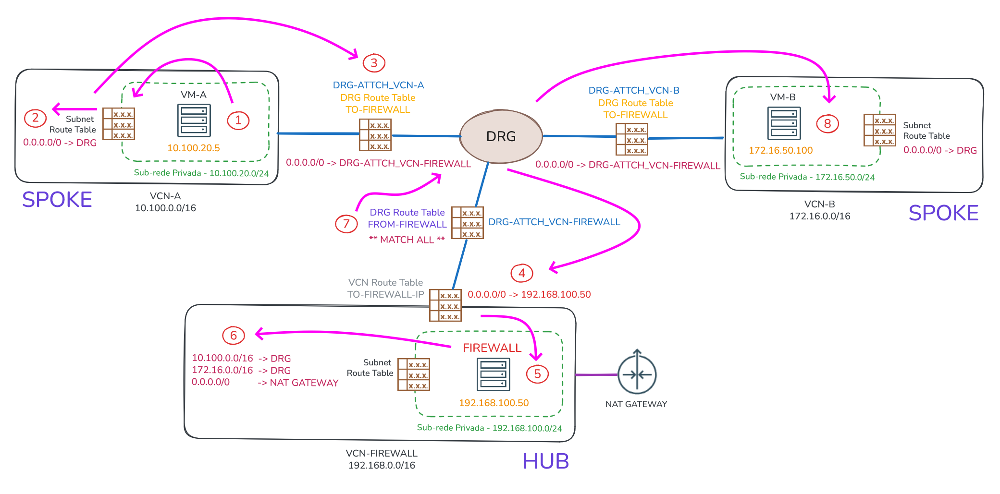

# Roteamento via Firewall Central (hub & spoke)

## Topologia Hub & Spoke

A topologia do tipo **Hub & Spoke** é muito utilizada em ambientes corporativos, nos quais há, geralmente, a necessidade de um firewall mais sofisticado (VCN Hub), capaz de oferecer maior controle e proteção sobre o tráfego entre aplicações (VCNs Spoke), sejam entre VCNs ou no fluxo de dados entre o ambiente on-premises e o OCI. 

De forma simples, a ideia geral é: **forçar, de forma transparente, que todo o tráfego entre aplicações passe por um firewall central.**

Para ilustrar o funcionamento dessa topologia, será utilizado o diagrama abaixo:

Falando das tabelas de roteamento, temos as que seguem:

- **Subnet Route Table**
    - Cada sub-rede tem a sua própria tabela de roteamento sendo que, há somente uma regra de roteamento no qual direciona todo o tráfego para o DRG (0.0.0.0/0).

- **DRG Route Table**
    - Há duas tabelas de roteamento do DRG que são:
        - **TO-FIREWALL**
            - Usada para direcionar todo o tráfego ao anexo do firewall (DRG‑ATTCH_VCN‑FIREWALL). A tabela contém apenas uma rota estática e deve ser aplicada a todos os anexos cujo tráfego precise obrigatoriamente passar pelo firewall.
        - **FROM-FIREWALL**
            - Utilizada pelo anexo do firewall e consultada no retorno do tráfego para a rede. Ou seja, quando o firewall envia a resposta. As rotas dessa tabela são inseridas automaticamente via instrução **Match All**, pois o firewall conhece e aprende todas as redes.

- **VCN Route Table**
    - Apenas do nome fazer referência a VCN, trata‑se de uma tabela de sub‑rede configurada no anexo do firewall. Esta tabela é consultada assim que o tráfego entra na VCN-FIREWALL, no qual possui apenas uma regra estática cujo next‑hop aponta para o endereço IP do firewall (192.168.100.50).