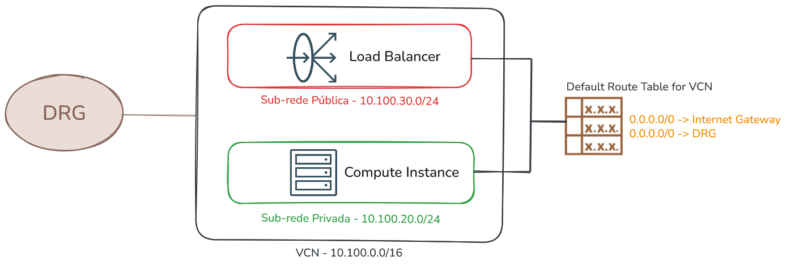
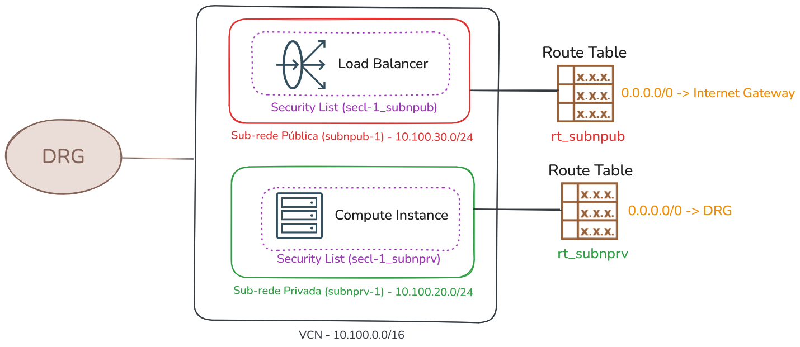

# Roteamento

## VCN e Roteamento

Uma das primeiras atividades ao iniciar os trabalhos com o OCI é configurar corretamente uma VCN (Virtual Cloud Network) e seus componentes de rede. Pode-se afirmar que uma VCN é uma rede maior que pode ser subdividida em partes menores, chamadas de sub-redes (subnets).

Cada sub-rede consiste em uma faixa contínua de endereços IP únicos (conforme RFC1918) que existem dentro da mesma VCN. É nas sub-redes que se pode criar instâncias computacionais e outros recursos que dependem de uma rede IP para funcionar e se comunicar.

A sub-rede atua como uma unidade de configuração para os recursos criados dentro dela, mais especificamente para as VNICs. Isso significa que todas as VNICs e outros recursos em nuvem criados na mesma sub-rede compartilham a mesma Route Table, Security Lists e DHCP Options.

Um aspecto relevante ao criar uma nova VCN, no que diz respeito ao roteamento, é que ela vem automaticamente com uma Route Table padrão (```Default Route Table for <NOME-DA-VCN>```). Todas as sub-redes criadas dentro dessa VCN, a menos que especificado de outra forma, utilizarão essa mesma Route Table. Isso pode dificultar a configuração do roteamento quando as sub-redes dessa VCN exigem configurações de roteamento de forma independente.

Por exemplo, em uma VCN que contém duas sub-redes - uma pública e outra privada - é esperado que cada sub-rede tenha sua própria tabela de roteamento. A sub-rede pública precisa de uma rota padrão que direcione o tráfego para o Internet Gateway (IGW), permitindo que os recursos criados recebam e enviem tráfego da Internet. Por outro lado, na sub-rede privada, a rota padrão costuma direcionar o tráfego para um NAT Gateway (NGW) ou para o DRG.



A boa prática que fica é:

1. Criar a VCN.
2. Criar os Gateways de Comunicação necessários da VCN (Internet Gateway, Nat Gateway e Service Gateway).
3. Criar as Route Tables específicas, de acordo com o número e tipo das sub-redes (por exemplo, criar a Route Table ```rt_subnpub``` para a sub-rede pública e ```rt_subnprv``` para a sub-rede privada).
4. Criar as Security Lists conforme a quantidade necessária de sub-redes.
5. Configurar as regras de roteamento e as regras das Security Lists.
6. OPCIONAL: Se necessário, criar os DHCP Options de forma independente, um para cada sub-rede (pessoalmente, prefiro utilizar o DHCP Options que foi criado junto com a VCN para todas as sub-redes da VCN).
7. Criar as sub-redes e utilizar a tabela de roteamento e a Security List criadas de forma independente para cada sub-rede.

O resultado final, por exemplo, para cada VCN, será similar ao desenho abaixo:

