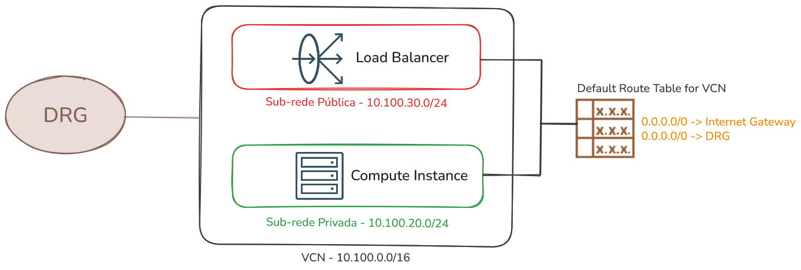
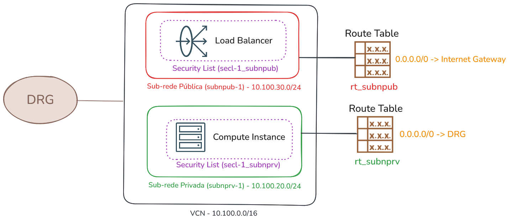
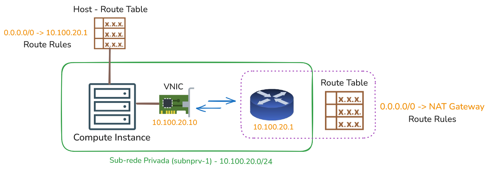

# VCN e Roteamento de Sub-rede

Uma das primeiras atividades ao iniciar os trabalhos com o OCI é configurar corretamente uma VCN (Virtual Cloud Network) e seus componentes de rede. Pode-se afirmar que uma VCN é uma rede maior que pode ser subdividida em partes menores, chamadas de sub-redes (subnets).

Cada sub-rede consiste em uma faixa contínua de endereços IP únicos (conforme RFC1918) que existem dentro da mesma VCN. É nas sub-redes que se pode criar instâncias computacionais e outros recursos que dependem de uma rede IP para funcionar.

A sub-rede atua como uma unidade de configuração para os recursos criados dentro dela, mais especificamente para as VNICs que ali forem criadas. Isso significa que todas as VNICs e outros recursos em nuvem criados na mesma sub-rede compartilham a mesma Route Table, Security Lists e DHCP Options.

Um aspecto relevante ao criar uma nova VCN, no que diz respeito ao roteamento, é que ela vem automaticamente com uma Route Table padrão (```Default Route Table for <NOME-DA-VCN>```). Todas as sub-redes criadas dentro dessa VCN, a menos que especificado de outra forma, utilizarão essa mesma Route Table. Isso pode dificultar a configuração do roteamento quando as sub-redes dessa VCN exigem configurações de roteamento de forma independente.

Por exemplo, em uma VCN que contém duas sub-redes - uma pública e outra privada - **é esperado que cada sub-rede tenha sua própria tabela de roteamento**. A sub-rede pública precisa de uma rota padrão que direcione o tráfego para o Internet Gateway (IGW), permitindo que os recursos criados recebam e enviem tráfego da Internet. Por outro lado, na sub-rede privada, a rota padrão costuma direcionar o tráfego para um NAT Gateway (NGW) ou para o DRG.



**A boa prática que fica é:**

1. Criar a VCN.
2. Criar os Gateways de Comunicação necessários da VCN (Internet Gateway, Nat Gateway e Service Gateway).
3. Criar as Route Tables específicas, de acordo com o número e tipo das sub-redes (por exemplo, criar a Route Table ```rt_subnpub``` para a sub-rede pública e ```rt_subnprv``` para a sub-rede privada).
4. Criar as Security Lists conforme a quantidade necessária de sub-redes.
5. Configurar as regras de roteamento e as regras das Security Lists.
6. OPCIONAL: Se necessário, criar os DHCP Options de forma independente, um para cada sub-rede (pessoalmente, prefiro utilizar o DHCP Options que foi criado junto com a VCN para todas as sub-redes da VCN).
7. Criar as sub-redes e utilizar a tabela de roteamento e a Security List criadas de forma independente para cada sub-rede.

O resultado final, por exemplo, para cada VCN, será similar ao diagrama abaixo:



## Roteamento de Sub-rede

Roteamento de sub-rede refere-se à decisão de roteamento aplicada no momento em que um pacote sai da VNIC de um recurso computacional hospedado em uma determinada sub-rede. Esse tipo de roteamento também é conhecido como **_egress routing_** e é controlado pela tabela de rotas associada à sub-rede. Vale lembrar que toda sub-rede criada possui uma tabela de rotas vinculada.

A tabela de rotas da sub-rede funciona em conjunto com o endereço IP do gateway da sub-rede sendo que, uma sub-rede quando criada, **reserva o primeiro endereço IP do CIDR escolhido para ser o gateway dessa sub-rede**. Por exemplo, se o CIDR da sub-rede for **10.100.20.0/24**, o endereço IP do gateway será automaticamente **10.100.20.1**.

Manipular a tabela de rotas de uma sub-rede é relativamente simples, pois ela permite apenas a inserção de **regras estáticas** de forma manual (**static routes**). Além disso, o next-hop dessas regras pode ser definido de duas formas:

- Gateways de Comunicação
    - Neste caso, o destino pode ser qualquer um dos gateways de comunicação já apresentados.
- Endereço IP Privado (Private IP)
    - Um endereço IP privado de outra VNIC na mesma sub-rede, geralmente utilizado para encaminhar o tráfego para uma instância de computação que desempenha o papel de firewall.

Por exemplo, para adicionar uma regra de roteamento em que o next-hop seja um NAT Gateway, pode-se utilizar o seguinte comando:

```bash
$  oci network route-table update \
> --rt-id "ocid1.routetable.oc1.sa-saopaulo-1.aaaaaaaa" \
> --route-rules '[{"cidrBlock": "0.0.0.0/0","networkEntityId": "ocid1.natgateway.oc1.sa-saopaulo-1.aaaaaaaa"}]' \
> --force \
> --wait-for-state "AVAILABLE"
```

## Fluxo de Decisão de Roteamento

O fluxo de roteamento, ou a ordem de avaliação das regras de roteamento para alcançar uma rede diferente, inicia-se sempre no host e, em seguida, passa pela tabela de rotas da sub-rede.

Considere o exemplo a seguir: um compute instance com uma VNIC configurada com o endereço IP **10.100.20.10** deseja acessar a Internet, por exemplo, o endereço **8.8.8.8**.



1. A primeira decisão de roteamento ocorre dentro do host, onde o sistema operacional consulta sua própria tabela de rotas para determinar qual é o próximo destino do pacote. Nesse caso, a tabela de rotas do host aponta para o endereço IP **10.100.20.1**, ou seja, o next-hop é o gateway da sub-rede.

2. Quando o pacote chega ao gateway da sub-rede, uma nova decisão de roteamento entra em ação. Nesse ponto, a tabela de rotas associada à sub-rede é utilizada para determinar o próximo salto em direção à Internet, que, neste exemplo, é o NAT Gateway. A partir disso, o pacote pode alcançar endereços externos, como na Internet.